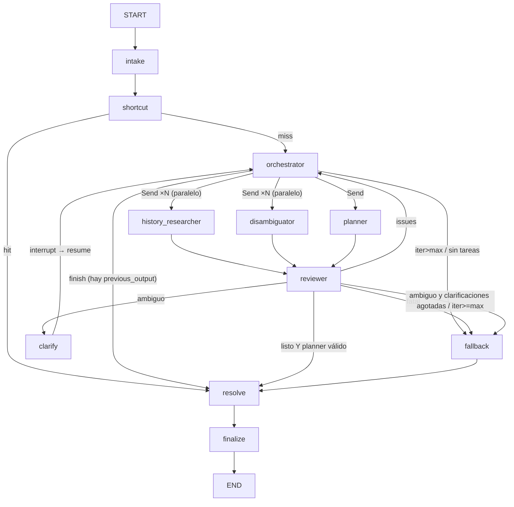

# Asesor de misión de compra: instrucciones para construir la Fase 1

> **Cómo usar este archivo.** Pegalo como `CLAUDE.md` en la raíz de un repo vacío.
> Pedile a Claude Code las etapas **en orden** (§12). Después de cada etapa, corré los tests y el `curl` indicados antes de seguir.
> Es autocontenido: no depende de ningún otro documento ni de código previo.
>
> **Entregable de la Fase 1.** Una API JSON (FastAPI) que recibe una frase del cliente y devuelve una canasta cross-categoría.
> - Un **agente LLM en grafo LangGraph** interpreta la necesidad, con salida controlada por Pydantic.
> - Un **motor determinista** aplica **filtros duros** y un **Score** por objetivos de negocio: Rentabilidad, Conversión, Reducir desperdicio, Mover inventario y Afinidad con carrito.
> - El LLM, la base de datos y el almacén de memoria viven detrás de **interfaces**.

---

## 1. Qué es y qué no es

Es un retailer multicategoría: **supermercado + autos + hogar** bajo el mismo techo.
El producto **no es un buscador**. Es un **asesor de misión de compra**: toma una necesidad ("me voy de paseo a la playa con 2 niños y el carro necesita revisión") y arma una canasta que cruza categorías.
KPIs: **ticket promedio** e **ítems por canasta**.

**Arquitectura en una frase:**
> La base de datos decide qué existe. El negocio decide el orden (score). El agente decide cómo interpretar y qué preguntar.
> El LLM **nunca** ve productos, precios ni orden de catálogo: produce un **plan estructurado** (`MissionPlan`), y lo demás es Python determinista.

```
frase ──► [Agente LangGraph: interpreta → MissionPlan] ──► [resolve: repos → filtro duro → score] ──► MissionResponse (JSON)
                   (LLM, Pydantic)                              (Python puro, sin LLM, dentro del grafo)
```

---

## 2. Reglas que no se negocian

1. **El contrato es `app/domain/schema.py`.** Nada después del adaptador conoce el formato original de los datos. No se inventan campos: si algo falta, se declara ausente.
2. **Sólo 4 campos son obligatorios** en un producto: `product_id`, `name`, `category`, `price.amount`. Todo lo demás es degradable, y cada feature define qué hace sin ese dato.
3. **Ausente ≠ cero.** Una señal que falta se **elimina** del score y su peso se **redistribuye** entre las presentes. Nunca `COALESCE(x, 0)` ni `x or 0`.
4. **Cada señal lleva su procedencia** (`SignalSource`), que viaja en el JSON de respuesta:
   - `REAL`: dato del catálogo.
   - `DERIVED`: imputado o calculado.
   - `SIMULATED`: sintético.
5. **El agente sólo traduce la necesidad a un `MissionPlan`.**
   - Ni el orquestador ni los subagentes ven productos, precios ni ranking.
   - El filtro duro y el ranking viven **sólo** en `app/engine/` y `app/services/basket_service.py`.
   - Una acción que el agente no puede expresar ("más barato", "cambiá los pesos") es una operación determinista sobre la canasta ya resuelta (endpoint `/rescore`). **No pasa por el LLM.**
6. **`app/agent/` no importa nada de `app.*`** fuera de sí mismo. Es un módulo genérico: lo específico del retailer vive en `app/mission_agent/`. Un test de portabilidad por AST lo hace cumplir (§9.9).
7. **Todo loop está acotado:** iteraciones del orquestador, intentos por subagente, clarificaciones, rondas de tools y `recursion_limit`. Ningún camino puede quedar reintentando para siempre.
8. **Las citas no se redactan, se recortan.** Si se muestra texto de un documento, debe ser substring literal validado (`snippet in doc_text`). Sin respaldo, se dice "sin respaldo documental". Esto es opcional en la Fase 1.

### Prohibido
- Frameworks de agentes de alto nivel: CrewAI, LlamaIndex, pydantic-ai, `AgentExecutor` de LangChain.
  **Permitido:** LangGraph + `langchain-core` + `langchain-anthropic`, confinados a `app/agent/`, para un grafo explícito con control de iteraciones.
- ORM, migraciones y base de datos externa **para el catálogo**: SQLite de sólo lectura con SQL a mano.
  La única base externa permitida es Firestore, y **sólo** para checkpoints de conversación. Nunca catálogo ni carrito.
- Autenticación y cuentas. El `user_id` es un identificador opaco que manda el cliente.
- Embeddings en runtime.

---

## 3. Stack y estructura

- **Lenguaje y API:** Python 3.12 · `uv` · FastAPI · Pydantic v2 · pydantic-settings · uvicorn.
- **Agente:** LangGraph · langchain-core · langchain-anthropic.
- **Datos y tests:** SQLite (`sqlite3` stdlib) · pytest + pytest-asyncio (`asyncio_mode = "auto"`).
- **Modelos:**
  - Estándar: **`claude-sonnet-5`**.
  - Razonamiento: **`claude-opus-5`**. Se escala **por turno y por subagente**, nunca queda fijo.

```bash
uv init --python 3.12
uv add fastapi "uvicorn[standard]" pydantic pydantic-settings langgraph langchain-core langchain-anthropic anthropic
uv add --dev pytest pytest-asyncio httpx
# opcional (E8): uv add google-cloud-firestore
```

`pyproject.toml`:
```toml
[tool.pytest.ini_options]
pythonpath = ["."]
asyncio_mode = "auto"
markers = ["firestore: requiere emulador"]
```

```
app/
  main.py                    # FastAPI + lifespan (arma AgentService y repos)
  settings.py                # AppSettings (CATALOG_DB_PATH, etc.)
  api/
    routes.py                # endpoints JSON /api/v1/...
    models.py                # request/response Pydantic de la API
    deps.py                  # Depends(): get_agent, get_catalog_repo...
  domain/
    schema.py                # EL CONTRATO (§4)
    specifications.py        # registro de atributos + evaluate_requirement
  adapters/catalog_adapter.py        # row SQLite -> Product
  repositories/
    ports.py                 # CatalogRepository, AffinityRepository (Protocols)
    sqlite_catalog.py        # implementación real
    memory_catalog.py        # implementación para tests
  engine/
    hard_filter.py           # §7
    scoring.py               # §8
  services/basket_service.py # MissionPlan -> Basket (orquesta repos + engine)
  agent/                     # MÓDULO GENÉRICO (§9), no importa app.*
    contracts.py domain.py service.py runtime.py config.py
    graph/{builder,routing,state,schemas,policies}.py
    graph/nodes/{intake,shortcut,orchestrator,history_researcher,disambiguator,planner,reviewer,clarify,fallback,resolve,finalize}.py
    subagents/{base,history_researcher,disambiguator,planner}.py
    llm/{router,providers,errors,tiers}.py
    persistence/{ports,checkpointer,factory}.py + backends/{memory,firestore}.py
    tools/session_history.py
    prompts/*.md + prompts/domains/retail_mission/{brief,planner,planner_revision}.md
  mission_agent/             # PEGAMENTO retailer <-> agente
    domain.py                # RetailMissionDomain (implementa AgentDomain)
    bridge.py                # MissionPlanDraft -> MissionPlan
    keyword_fallback.py seeds.py snapshot.py
  data/attribute_definitions.json
scripts/seed_catalog.py
tests/{test_hard_filter,test_scoring,test_basket_service,test_api}.py
tests/agent/{fakes,conftest,test_graph_*,test_module_is_portable}.py
```

---

## 4. Contrato de dominio (`app/domain/schema.py`)

Todos los modelos son `frozen=True`, salvo `MissionPlanDraft` y `AttributeRequirement`, que el LLM llena.

```python
class Category(str, Enum):      GROCERY="grocery"; AUTO="auto"; HOME="home"; UNKNOWN="unknown"
class SignalSource(str, Enum):  REAL="real"; DERIVED="derived"; SIMULATED="simulated"
class AvailabilityStatus(str, Enum): IN_STOCK; LOW_STOCK; OUT_OF_STOCK; UNKNOWN   # UNKNOWN nunca descarta
class MissionKind(str, Enum):   TRIP; VEHICLE_MAINTENANCE; HOME_SETUP; EVENT; RESTOCK; GENERIC
class ExclusionReason(str, Enum):
    DISCONTINUED; OUT_OF_STOCK; EXPIRED; NOT_IN_SELECTED_STORE; WRONG_CATEGORY; INCOMPATIBLE
    MISSING_REQUIRED_ATTRIBUTE; WRONG_REQUIRED_ATTRIBUTE_VALUE; OVER_BUDGET; NO_TEXT_MATCH
class Currency(str, Enum): USD; PEN; COP; MXN; CLP

class Signal(BaseModel, Generic[T]):
    value: T
    source: SignalSource = SignalSource.REAL
    confidence: float = Field(1.0, ge=0, le=1)
    note: str | None = None

class Price(BaseModel):
    amount: Decimal = Field(ge=0)
    currency: Currency = Currency.USD
    promo_amount: Decimal | None = None          # validator: promo <= amount
    @computed_field
    def effective_amount(self) -> Decimal: return self.promo_amount if self.promo_amount is not None else self.amount

class StoreStock(BaseModel):
    store_id: str            # "__ALL__" = comodín "cualquier tienda"
    qty: int | None = Field(None, ge=0)
    status: AvailabilityStatus = AvailabilityStatus.UNKNOWN

class BusinessSignals(BaseModel):          # TODAS opcionales: None = ausente, nunca 0
    margin_pct: Signal[float] | None = None          # 0..1  -> Rentabilidad
    conversion_rate: Signal[float] | None = None     # 0..1 compras/vistas -> Conversión
    days_to_expiry: Signal[float] | None = None      # sólo perecibles -> Reducir desperdicio
    inventory_age_days: Signal[float] | None = None  # -> Mover inventario
    days_of_supply: Signal[float] | None = None      # stock / venta diaria -> Mover inventario
    is_private_label: Signal[bool] | None = None     # informativo (no puntúa en Fase 1)

class Product(BaseModel):
    product_id: str; name: str; category: Category; price: Price      # los 4 obligatorios
    subcategory: str | None = None; brand: str | None = None; description: str | None = None
    unit: str | None = None; pack_size: float | None = None
    attributes: dict[str, str | float] = {}
    attribute_sources: dict[str, SignalSource] = {}
    stock: list[StoreStock] = []
    signals: BusinessSignals = BusinessSignals()
    is_active: bool = True
    @computed_field
    def availability(self) -> AvailabilityStatus: ...
    # sin stock -> UNKNOWN; si no, el primero presente entre IN_STOCK, LOW_STOCK, UNKNOWN; si no, OUT_OF_STOCK

class AttributeRequirement(BaseModel):
    attribute: str                                   # clave canónica del registro (§7.2)
    operator: Literal["eq", "gte", "lte", "between", "contains"] = "eq"
    value: str
    upper_value: str | None = None                   # obligatorio si between
    unit: str | None = None
    source_text: str = ""                            # fragmento LITERAL del usuario; vacío => falla cerrado

class BasketSlot(BaseModel):                         # UNA necesidad funcional = UN tipo de producto
    slot_id: str; label: str; rationale: str = ""
    target_category: Category = Category.UNKNOWN
    keywords: list[str] = []                         # 4..8 términos
    attribute_requirements: list[AttributeRequirement] = []
    preferred_brands: list[str] = []                 # sólo si el cliente las nombró
    quantity: int = Field(1, ge=1)
    priority: int = Field(3, ge=1, le=5)             # 1 = imprescindible
    is_optional: bool = False

class MissionConstraints(BaseModel):
    budget_total: Decimal | None = None; currency: Currency = Currency.USD
    store_id: str | None = None; group_size: int | None = Field(None, ge=1)
    has_children: bool | None = None
    vehicle: dict[str, str] | None = None            # {"make","model","year","tire_size"}
    excluded_categories: list[Category] = []

class MissionPlanDraft(BaseModel):                   # LO QUE EMITE EL LLM (output_model del planner)
    mission_kind: MissionKind = MissionKind.GENERIC
    title: str | None = None
    slots: list[BasketSlot] = []
    constraints: MissionConstraints = MissionConstraints()
    entities: dict[str, Any] = {}                    # destination, occasion, transport

class MissionPlan(MissionPlanDraft):                 # frozen; lo arma el bridge, no el LLM
    raw_input: str
    interpreted_by: Literal["llm", "keyword_fallback", "cached_seed"] = "llm"
    @computed_field
    def spanned_categories(self) -> list[Category]: ...

SignalName = Literal["relevance", "profitability", "conversion", "waste", "inventory", "affinity"]

class ScoringWeights(BaseModel):                     # no necesitan sumar 1: se renormalizan
    relevance: float = Field(0.50, ge=0, le=1)
    profitability: float = Field(0.15, ge=0, le=1)
    conversion: float = Field(0.12, ge=0, le=1)
    waste: float = Field(0.08, ge=0, le=1)
    inventory: float = Field(0.08, ge=0, le=1)
    affinity: float = Field(0.07, ge=0, le=1)

class ScoreComponent(BaseModel):
    signal: SignalName
    raw_value: float | None                          # valor crudo (None si imputado)
    normalized: float                                # 0..1
    weight_applied: float                            # ya renormalizado
    contribution: float                              # weight_applied * normalized
    source: SignalSource

class ScoredProduct(BaseModel):
    product: Product; slot_id: str
    total_score: float = Field(ge=0, le=1)
    breakdown: list[ScoreComponent] = []
    missing_signals: list[SignalName] = []           # señales muertas en este set
    excluded_reason: ExclusionReason | None = None
    exclusion_detail: str | None = None
    matches_preferred_brand: bool | None = None      # None si el slot no pidió marca
    @computed_field
    def is_recommended(self) -> bool: return self.excluded_reason is None

class ResolvedSlot(BaseModel):
    slot: BasketSlot
    picked: ScoredProduct | None
    alternatives: list[ScoredProduct] = []           # ≤ 3
    rejected: list[ScoredProduct] = []               # ≤ 3
    most_common_rejection_reason: ExclusionReason | None = None

class Basket(BaseModel):
    mission: MissionPlan; slots: list[ResolvedSlot]; weights: ScoringWeights
    # computed: items_count, estimated_ticket, categories_covered, is_cross_category (>=2), budget_remaining, unfulfilled_slots
```

---

## 5. Interfaces (puertos) e implementaciones

Toda dependencia externa entra por un `Protocol` y tiene **una implementación real y una fake**.

### 5.1 Proveedor de LLM (`app/agent/llm/`)

```python
class ModelTier(str, Enum): STANDARD = "standard"; REASONING = "reasoning"

class LLMRouter(Protocol):
    def get(self, role: str, tier: ModelTier) -> BaseChatModel: ...
    def model_name(self, role: str, tier: ModelTier) -> str: ...
```

- **`DefaultLLMRouter(settings)`**:
  - Resuelve `(role, tier)` a `(provider, model)`: STANDARD → `AGENT_LLM_STANDARD_MODEL`, REASONING → `AGENT_LLM_REASONING_MODEL`.
  - Admite overrides por rol en `AGENT_LLM_ROLE_OVERRIDES` (JSON).
  - Cachea una instancia por `(role, tier)`.
- **Fábricas de proveedores** con import lazy, en un dict `{"anthropic": ..., "openrouter": ..., "google": ...}`:
  - `ChatAnthropic(model=..., max_retries=0, max_tokens=4096)`.
  - Los reintentos los hace el grafo, nunca el SDK.
- **Salida estructurada, SIEMPRE así:**
  ```python
  llm.with_structured_output(OutputModel, method="function_calling")
  ```
  La tool call forzada funciona igual en Anthropic, OpenRouter y Google. `json_schema` se rompe con Claude detrás de OpenRouter.
- **Clasificación de errores** con `classify(exc)`. Ningún nodo mira excepciones nativas del SDK.

  | Clase | Cuándo | Qué hace el grafo |
  |---|---|---|
  | `TransientError(retry_after)` | status 408/409/425/429/5xx/529, o clases `APITimeoutError` / `APIConnectionError` / `TimeoutError` / `ConnectError` | `RetryPolicy` del nodo reintenta con backoff |
  | `BadRequestError` | resto de 4xx | error de negocio → re-planificar |
  | `FatalError` | 401/403 | fallback directo |
  | **`OutputError`** | `pydantic.ValidationError`, `OutputParserException`, o el modelo no llamó la tool | re-planificar **y escalar** ese subagente a REASONING |

  > ⚠️ Envolvé la llamada estructurada en `try/except (ValidationError, OutputParserException)` y relanzá `OutputError`.
  > Si no, `classify` lo convierte en `FatalError` y todo error de formato termina en fallback. Ese fue el bug de la versión anterior.
- **Fake para tests** (`tests/agent/fakes.py`):
  - `FakeLLMRouter.get(role, tier)` registra `requested_tiers` y devuelve un `FakeChatModel` por rol.
  - `FakeChatModel(structured_queue=[...])` devuelve en orden instancias Pydantic o **lanza** las `Exception` de la cola.
  - `bind_tools` devuelve `self`, `tool_turns` simula tool calls, y hay logs `calls` / `inputs`.
  - **Los tests del agente nunca tocan red.**

### 5.2 Proveedor de base de datos (catálogo)

```python
class CatalogRepository(Protocol):
    def candidates(self, category: Category, *, limit: int = 500) -> list[Product]: ...
    def get(self, product_id: str) -> Product | None: ...
    def get_many(self, product_ids: Sequence[str]) -> list[Product]: ...

class AffinityRepository(Protocol):
    def lifts(self, candidate_ids: Sequence[str], cart_ids: Sequence[str]) -> dict[str, tuple[float, SignalSource]]:
        """candidate_id -> (max lift contra cualquier item del carrito, source). Sin dato => no aparece (ausente)."""
```

- **`SqliteCatalogRepository(db_path)`**:
  - Conexión `sqlite3.connect(f"file:{path}?mode=ro", uri=True, check_same_thread=False)` con `row_factory = sqlite3.Row`.
  - SQL a mano: `SELECT * FROM products WHERE is_active = 1 AND (? = 'unknown' OR category = ?) ORDER BY product_id LIMIT ?`.
  - **Siempre `ORDER BY`**: sin orden, los empates dependen del orden físico de las filas y el ranking deja de ser reproducible.
  - Mapea cada fila con `row_to_product(row)` desde `app/adapters/catalog_adapter.py`.
- **`SqliteAffinityRepository`**:
  - Busca en `product_affinity` y toma el máximo por candidato, con source `REAL`.
  - Si no hay par producto-producto, cae a `category_affinity` con source `DERIVED`.
  - Si tampoco hay, el candidato no aparece en el resultado.
- **`InMemoryCatalogRepository(products)` / `InMemoryAffinityRepository(pairs)`** para tests de motor y servicio.
- El filtrado por texto **no** va en SQL en la Fase 1: se hace en Python (§7.3). Si da el tiempo, FTS5 puede sumarse como pre-filtro de recall.

### 5.3 Memoria del agente (checkpoints)

```python
class CheckpointStore(Protocol):   # KV de bytes, sin tipos de LangGraph
    async def put_checkpoint(self, *, thread_id, user_id, checkpoint_ns, checkpoint: StoredCheckpoint,
                             thread_title: str | None, thread_summary: str | None) -> None: ...
    async def get_checkpoint(self, thread_id, checkpoint_ns, checkpoint_id: str | None = None) -> StoredCheckpoint | None: ...
    async def list_checkpoints(self, thread_id, checkpoint_ns, *, before: str | None = None, limit: int | None = None) -> list[StoredCheckpoint]: ...
    async def put_writes(self, thread_id, checkpoint_ns, checkpoint_id, writes: list[StoredWrite]) -> None: ...
    async def get_writes(self, thread_id, checkpoint_ns, checkpoint_id) -> list[StoredWrite]: ...
    async def list_threads(self, user_id: str, limit: int = 20) -> list[ThreadRecord]: ...
    async def delete_thread(self, thread_id: str) -> None: ...
    async def aclose(self) -> None: ...
```

- **`StoreCheckpointSaver(BaseCheckpointSaver)`** adapta el store a LangGraph.
  - Implementa `aget_tuple`, `alist`, `aput` y `aput_writes`, serializando con `self.serde.dumps_typed`.
  - Es sólo async; `aput` exige `configurable.user_id`.
- **Atajo para E3:** usar directamente `langgraph.checkpoint.memory.InMemorySaver` y dejar el store propio para E8.
- **`build_store(settings)`**:
  - `memory` (default, en local y tests) → `InMemoryCheckpointStore`, con dicts + `asyncio.Lock`.
  - `firestore` → `FirestoreCheckpointStore`, con import lazy.
    - Colecciones `{prefix}_threads/{thread_id}` con subcolecciones `checkpoints/{ns}:{id}` y `writes/{ns}:{id}:{task}:{idx}`.
    - Índice compuesto `user_id ASC, updated_at DESC`.

### 5.4 Dominio del agente (el único punto de extensión)

```python
@runtime_checkable
class AgentDomain(Protocol):
    name: str
    output_model: type[BaseModel]        # MissionPlanDraft
    prompt_key: str                      # "retail_mission" -> prompts/domains/retail_mission/
    def shortcut(self, request: AgentRequest) -> dict | None: ...          # caché exacta, sin LLM
    def fallback(self, request: AgentRequest) -> dict: ...                 # NUNCA None, nunca lanza
    def resolve(self, output: dict, request: AgentRequest) -> dict: ...    # DETERMINISTA: plan -> canasta
    def summarize_snapshot(self, snapshot: dict) -> str: ...
```

`RetailMissionDomain` (en `app/mission_agent/domain.py`) recibe en su constructor `catalog_repo` y `affinity_repo`.
- `resolve` hace `bridge.draft_to_plan(...)` y luego `basket_service.resolve_mission(...)`.
- Devuelve `{"plan": plan.model_dump(mode="json"), "basket": basket.model_dump(mode="json")}`.
- Así el grafo sigue siendo genérico, y el LLM nunca recibe esa salida.

---

## 6. Datos: esquema SQLite y seed sintético

```sql
CREATE TABLE products (
  product_id TEXT PRIMARY KEY, name TEXT NOT NULL, category TEXT NOT NULL,
  subcategory TEXT, brand TEXT, description TEXT, unit TEXT, pack_size REAL,
  price_amount TEXT NOT NULL, currency TEXT NOT NULL DEFAULT 'USD', promo_amount TEXT,
  is_active INTEGER NOT NULL DEFAULT 1,
  attributes_json TEXT NOT NULL DEFAULT '{}',   -- {"tire_size":"205/55R16","volume_ml":500}
  stock_json      TEXT NOT NULL DEFAULT '[]',   -- [{"store_id":"__ALL__","qty":12,"status":"in_stock"}]
  signals_json    TEXT NOT NULL DEFAULT '{}'    -- {"margin_pct":{"value":0.31,"source":"simulated"}, ...}
);
CREATE INDEX ix_products_category ON products(category, is_active);

CREATE TABLE product_affinity (product_a TEXT NOT NULL, product_b TEXT NOT NULL, lift REAL NOT NULL,
  PRIMARY KEY (product_a, product_b));
CREATE TABLE category_affinity (subcategory_a TEXT NOT NULL, subcategory_b TEXT NOT NULL, lift REAL NOT NULL,
  PRIMARY KEY (subcategory_a, subcategory_b));
CREATE TABLE compatibility_rules (rule_id TEXT PRIMARY KEY, subject_json TEXT NOT NULL,
  target_attribute TEXT NOT NULL, operator TEXT NOT NULL, values_json TEXT NOT NULL DEFAULT '[]',
  range_lo REAL, range_hi REAL);
```

**Adaptador** `row_to_product(row)`:
- Una clave ausente en `signals_json` produce `None`, **nunca 0**.
- `_signal(raw)` construye `Signal(value, source=SignalSource(raw.get("source","real")), confidence=raw.get("confidence",1.0))`.
- Atributos faltantes: se pueden extraer del nombre por regex (`name_pattern` del registro) y marcarse `DERIVED` en `attribute_sources`.

**Seed** (`scripts/seed_catalog.py`, determinista con `random.Random(42)`). Construye unos 300 productos:
- **grocery**, unos 180: bloqueador, gaseosa, pañales, toallitas, snacks, agua, frutas y lácteos (los perecibles llevan `days_to_expiry`).
- **auto**, unos 60: llantas con `tire_size`, aceite con `viscosity`, refrigerante y kit de carretera.
- **home**, unos 60: cooler con `capacity_l`, sillas de playa, organizadores y linternas.

Sus datos:
- **Señales:** todas `"source": "simulated"`, con **huecos deliberados**:
  - Unos 25% sin `conversion_rate`.
  - `days_to_expiry` **sólo** en perecibles.
  - Unos 10% sin `margin_pct`.
- **Stock y marcas:** unos 5% `out_of_stock`, unos 3% `is_active=0`, varias marcas por tipo y 2 o 3 marcas propias.
- **Afinidades:** unos 400 pares `product_affinity`, más una matriz `category_affinity` por subcategoría (p. ej. bloqueador↔cooler 1.8, llanta↔aceite 1.5).
- **Compatibilidad:** reglas de llanta por vehículo, p. ej. `{"make":"toyota","model":"corolla"}` → `tire_size IN ["205/55R16","195/65R15"]`.

---

## 7. Filtros duros (`app/engine/hard_filter.py`)

`apply_hard_filter(product, slot, ctx) -> HardFilterResult(excluded_reason, exclusion_detail, compatibility_checked, compatibility_passed)`

Donde `ctx = FilterContext(store_id, budget_remaining, vehicle, compatibility_rules, as_of)`.

### 7.1 Orden exacto (cortocircuito en la primera falla)

| # | Criterio | Regla | Motivo |
|---|---|---|---|
| 1 | Activo | `not product.is_active` | `DISCONTINUED` |
| 2 | Stock | `availability is OUT_OF_STOCK` (UNKNOWN **pasa**) | `OUT_OF_STOCK` |
| 3 | Vencido | `days_to_expiry is not None and value <= 0` | `EXPIRED` |
| 4 | Tienda | si `ctx.store_id` y el producto tiene stock: ni `"__ALL__"` ni `store_id` en sus `store_id` | `NOT_IN_SELECTED_STORE` |
| 5 | Categoría | `slot.target_category != UNKNOWN and product.category != slot.target_category` | `WRONG_CATEGORY` |
| 6 | Compatibilidad | reglas cuyo `subject` ⊆ `ctx.vehicle` (comparación casefold) y cuyo `target_attribute` está en el producto; todas deben pasar: `EQUALS`, `IN_SET`, `BETWEEN` (float en rango) o `MATCHES_PATTERN` (`re.fullmatch`) | `INCOMPATIBLE` |
| 7 | Requisito sin evidencia | `req.source_text == ""` o `evaluate_requirement(...) is None` | `MISSING_REQUIRED_ATTRIBUTE` |
| 8 | Requisito incumplido | `evaluate_requirement(...) is False` | `WRONG_REQUIRED_ATTRIBUTE_VALUE` |
| 9 | Presupuesto | `ctx.budget_remaining is not None and effective_amount * slot.quantity > budget_remaining` | `OVER_BUDGET` |

Después, el **post-filtro de texto**: si el slot tiene `keywords` y el producto no coincide con ninguna, queda excluido con `NO_TEXT_MATCH`.

> ⚠️ **Cablear TODO el contexto.** En la versión anterior el filtro soportaba presupuesto, tienda y compatibilidad, pero el servicio no le pasaba `budget_remaining`, `store_id` ni las reglas, así que nunca se aplicaban.
> Hay un test de servicio que lo verifica: un plan con presupuesto chico debe producir `OVER_BUDGET`.

**El presupuesto es secuencial.** `basket_service` resuelve los slots ordenados por `(priority, slot_id)` y descuenta de `budget_remaining` el `effective_amount × quantity` de cada elegido.
Si la request trae `budget`, pisa `constraints.budget_total`.

### 7.2 Requisitos de atributo (`app/domain/specifications.py`)

Un registro en `app/data/attribute_definitions.json` define cada atributo:
`AttributeDefinition(key, label, aliases, kind: "text"|"number"|"range", unit, unit_factors, minimum_attribute, maximum_attribute, name_pattern)`.

Claves: `size, tire_size, viscosity, voltage, capacity_l, capacity_people, spf, length_cm, width_cm, material, color, supported_weight_kg (range), supported_age_months (range), units_per_pack, volume_ml, flavor, sugar_free, container_type`.

`evaluate_requirement(req, product) -> bool | None` (`None` significa que no se puede verificar):
- **text:** sólo `eq`, comparado con `str(a).strip().casefold() == value.strip().casefold()`.
- **number:** `eq` (`math.isclose`), `gte`, `lte` y `between`, después de convertir unidades con `unit_factors`. Si la unidad es incompatible, devuelve `None`.
- **range:** sólo `contains`, con `min_attr <= value <= max_attr`. Si falta metadato, devuelve `None`.

`normalize_requirements(plan)`, en el bridge:
- Canonicaliza aliases.
- **Vacía `source_text`** si no aparece literal (sin acentos y casefold) en `raw_input`.
- Elimina `preferred_brands` que el usuario no mencionó.

### 7.3 Coincidencia de texto

- `tokens(s)`: minúsculas, sin acentos (NFKD, `ñ→n`) y dividido por no-alfanuméricos.
- Una keyword coincide con un producto si **todas** sus palabras aparecen como **palabra completa** en `name + subcategory + description`.
- Tolera plural `+s` / `+es`.
- Tests obligatorios:
  - `"aseo"` **no** coincide con `"gaseosa"`.
  - `"pañal"` coincide con `"Pañales"`.
  - Acentos y mayúsculas se ignoran.
- `text_hits(p)` = cantidad de keywords que coinciden.

---

## 8. Score (`app/engine/scoring.py`)

### 8.1 Constantes

```python
COVERAGE_THRESHOLD = 0.60          # inclusivo: 60% vive, 59% muere
RELEVANCE_FLOOR = 0.20             # piso del peso de relevancia con sliders
RELEVANCE_MIX = (0.45, 0.35, 0.20) # (attr_match, text_match, category_match)
INVENTORY_MIX = (0.60, 0.40)       # (inventory_age_days, days_of_supply)
MIN_SET_SIZE_FOR_MINMAX = 3
SIGNAL_NAMES = ("relevance", "profitability", "conversion", "waste", "inventory", "affinity")
BUSINESS_SIGNALS = SIGNAL_NAMES[1:]
MAX_ALTERNATIVES = 3; MAX_REJECTED = 3
```

### 8.2 Normalización (sobre los **sobrevivientes del filtro duro** del slot)

```python
def minmax_normalize(values: dict[str, float]) -> dict[str, float]:
    if len(values) < 3: return {k: 0.5 for k in values}
    lo, hi = min(values.values()), max(values.values())
    if hi == lo: return {k: 0.5 for k in values}
    return {k: (v - lo) / (hi - lo) for k, v in values.items()}
```

Min-max se aplica **sólo sobre los productos que tienen el valor**. Los ausentes quedan en `None` hasta la regla de cobertura.

| Señal (objetivo) | Valor crudo | Normalizado nᵢ ∈ [0,1] | Ausente cuando |
|---|---|---|---|
| **relevance** | ver abajo | `0.45·attr_match + 0.35·text_match + 0.20·category_match` | nunca (siempre viva) |
| **profitability** (Rentabilidad) | `margin_pct` | `minmax(margin_pct)` | sin `margin_pct` |
| **conversion** (Conversión) | `conversion_rate` | `minmax(conversion_rate)` | sin `conversion_rate` |
| **waste** (Reducir desperdicio) | `days_to_expiry` | `1 − minmax(days_to_expiry)`: vence antes, prioridad más alta | producto no perecible (**ausente, no 0**) |
| **inventory** (Mover inventario) | `inventory_age_days`, `days_of_supply` | `0.60·minmax(age) + 0.40·minmax(dos)`; si falta uno, el otro pesa 100% | faltan ambos |
| **affinity** (Afinidad con carrito) | `max lift` contra el carrito | `minmax(lift)` | carrito vacío (muere para todo el set) o sin par ni categoría |

- `attr_match` = requisitos cumplidos / total, o 1.0 si no hay requisitos. Tras el filtro duro vale 1.0.
- `text_match` = `text_hits(p) / max(text_hits)` del set. Vale 1.0 si el slot no tiene keywords.
- `category_match` = 1.0 si la categoría del slot es UNKNOWN o igual a la del producto; si no, 0.0.
- **El carrito para afinidad** = `cart_product_ids` de la request **+ los productos ya elegidos en slots de mayor prioridad** (resolución secuencial, §7.1).
  El primer slot sin carrito previo no tiene afinidad: la señal muere y su peso se redistribuye.
- Orientación de "Mover inventario": **más antigüedad o más días de cobertura = más urgencia de mover = score más alto**. Hay que dejarlo documentado en el docstring y en el test: la versión anterior se contradecía acá.

### 8.3 Regla de cobertura (ausente ≠ cero)

```python
@dataclass(frozen=True)
class ResolvedComponent:
    alive: bool
    values: dict[str, float] = field(default_factory=dict)
    sources: dict[str, SignalSource] = field(default_factory=dict)

def resolve_business_component(normalized: dict[str, float | None], threshold=COVERAGE_THRESHOLD) -> ResolvedComponent:
    coverage = sum(v is not None for v in normalized.values()) / len(normalized) if normalized else 0.0
    if coverage < threshold:
        return ResolvedComponent(alive=False)                 # muere para TODO el set -> missing_signals
    present = {k: v for k, v in normalized.items() if v is not None}
    med = statistics.median(present.values())
    values, sources = dict(present), {k: SignalSource.REAL for k in present}   # o la source del Signal original
    for k, v in normalized.items():
        if v is None:
            values[k], sources[k] = med, SignalSource.DERIVED  # imputa MEDIANA, nunca 0
    return ResolvedComponent(True, values, sources)
```

A diferencia de la versión anterior, `sources` **sí** se propaga a `ScoreComponent.source`. Si el `Signal` original era `SIMULATED`, se conserva `SIMULATED`.

### 8.4 Fórmula: renormalización

```python
def combine_weighted_score(components: dict[str, float], weights: ScoringWeights,
                           live: Sequence[str] | None = None) -> tuple[float, dict[str, float]]:
    live = list(live) if live is not None else list(components)
    raw = {n: getattr(weights, n) for n in live}
    total = sum(raw.values())
    w = {n: 1.0 / len(live) for n in live} if total <= 0 else {n: v / total for n, v in raw.items()}
    score = sum(w[n] * components[n] for n in live)
    return min(1.0, max(0.0, score)), w
```

**score(p) = Σ w′ᵢ · nᵢ(p)**, con **w′ᵢ = wᵢ / Σⱼ∈vivas wⱼ**. Las vivas son `relevance` más las señales de negocio con `alive=True`.

### 8.5 Presets y sliders

```python
class ScoringPreset(str, Enum):
    BALANCEADO = "balanceado"; RENTABILIDAD = "rentabilidad"; CONVERSION = "conversion"
    DESPERDICIO = "desperdicio"; INVENTARIO = "inventario"; AFINIDAD = "afinidad"; RELEVANCIA_PURA = "relevancia_pura"

PRESETS: dict[ScoringPreset, ScoringWeights] = {
    BALANCEADO:      ScoringWeights(relevance=.50, profitability=.15, conversion=.12, waste=.08, inventory=.08, affinity=.07),
    RENTABILIDAD:    _focus("profitability"),   # relevance .40, foco .35, las otras 4 a .0625
    CONVERSION:      _focus("conversion"),
    DESPERDICIO:     _focus("waste"),
    INVENTARIO:      _focus("inventory"),
    AFINIDAD:        _focus("affinity"),
    RELEVANCIA_PURA: ScoringWeights(relevance=1, profitability=0, conversion=0, waste=0, inventory=0, affinity=0),
}

def apply_sliders(profitability, conversion, waste, inventory, affinity) -> ScoringWeights:
    relevance = max(RELEVANCE_FLOOR, 1.0 - (profitability + conversion + waste + inventory + affinity))
    return ScoringWeights(relevance=relevance, profitability=profitability, conversion=conversion,
                          waste=waste, inventory=inventory, affinity=affinity)
```

Cada slider va de 0 a 0.50. El piso garantiza que el negocio no pueda secuestrar el ranking: la relevancia siempre pesa.
Precedencia en la request: `weights` explícitos > `preset` > `BALANCEADO`.

### 8.6 `score_slot` y orden

```python
def score_slot(candidates, slot, weights, ctx, affinity_lifts) -> list[ScoredProduct]:
    # 1. hard filter a cada candidato -> excluidos (total_score=0, breakdown=[])
    # 2. post-filtro de texto -> NO_TEXT_MATCH
    # 3. sobre sobrevivientes: normalizar cada señal (8.2) -> cobertura (8.3) -> vivas
    # 4. combine_weighted_score por producto -> breakdown con contribution = w' * n
    # 5. matches_preferred_brand si slot.preferred_brands (comparación por brand_key casefold sin separadores)
    # 6. ordenar
```

**Clave de orden, determinista y total:**
```python
key = (sp.excluded_reason is not None,          # recomendados primero
       sp.matches_preferred_brand is False,     # marca pedida primero (NO altera total_score)
       -sp.total_score,
       sp.product.price.effective_amount,       # empate: más barato
       sp.product.product_id)                   # empate final estable
```

`ResolvedSlot` se arma así:
- `picked = recomendados[0]`.
- `alternatives = recomendados[1:4]`.
- `rejected = excluidos[:3]`.
- `most_common_rejection_reason = Counter(...)` sobre **todos** los excluidos. Si hay motivos distintos de `OUT_OF_STOCK`, se ignoran los `OUT_OF_STOCK` para que un solo agotado no se lleve la explicación.

### 8.7 Casos de test obligatorios (`tests/test_scoring.py`, tolerancia 1e-3)

1. **Todas las señales, preset BALANCEADO** (0.50/.15/.12/.08/.08/.07):

   | Producto | rel | prof | conv | waste | inv | aff | Score |
   |---|---|---|---|---|---|---|---|
   | A | .90 | .20 | .60 | .10 | .30 | .00 | **0.584** |
   | B | .70 | .90 | .50 | .80 | .70 | 1.00 | **0.735** |
   | C | .80 | .50 | .90 | .20 | .10 | .40 | **0.635** |

   Orden B > C > A.
2. **Renormalización.** `waste` muerta (set no perecible) y `affinity` muerta (carrito vacío).
   - Vivas: rel, prof, conv, inv. Suma cruda 0.85, así que w′ = rel .5882, prof .1765, conv .1412, inv .0941, con Σ = 1.
   - D = (.60, .90, .40, .80) → **0.6435**.
   - E = (.90, .30, .50, .10) → **0.6624**.
   - Resultado: E > D.
3. **El preset invierte el top.**
   - F = (rel .95, prof .20, resto .50) y G = (rel .60, prof .95, resto .50).
   - BALANCEADO: F **0.680** > G **0.6175**.
   - RENTABILIDAD: G **0.6975** > F **0.575**.
4. Señal ausente en todo el set: aparece en `missing_signals`, no en `breakdown`, y Σ `weight_applied` = 1.
5. Cobertura 70% (7 de 10): los 3 faltantes reciben la **mediana** (≠ 0) con source `DERIVED`.
6. Umbral 59/60/61 de 100: muere / vive / vive.
7. Piso: sliders (.5, .4, .3, .2, .1) → `relevance = 0.20` y w′_rel = 0.20/1.70 = **0.1176**.
8. Propiedad con 300 casos aleatorios (`random.Random(1234)`): score ∈ [0,1] y Σw′ = 1.
9. `minmax` con 1 o 2 valores da 0.5; con (0, 5, 10) da (0, .5, 1).
10. Un producto con sólo los 4 campos obligatorios recorre el motor entero, con todas las señales de negocio en `missing_signals`.
11. `waste`: en un set mixto perecible/no perecible con cobertura < 60%, muere. No hay que asignar 0 a los no perecibles.
12. `inventory`: con más antigüedad, el score de inventario es mayor.
13. Marca preferida: queda primera aunque tenga menos score, su `total_score` no cambia, y si está agotada **sigue excluida**.
14. Filtro duro: llanta de medida incorrecta da `WRONG_REQUIRED_ATTRIBUTE_VALUE`; requisito sin `source_text` da `MISSING_REQUIRED_ATTRIBUTE`.
15. Servicio: presupuesto chico da `OVER_BUDGET` en el slot de menor prioridad; con un vehículo incompatible da `INCOMPATIBLE`.

---

## 9. El agente LangGraph (`app/agent/`)

### 9.1 Contrato público (`contracts.py`, Pydantic simple y sin tipos de LangGraph)

```python
class AgentMode(str, Enum): START = "start"; REVISE = "revise"
class ClarificationAnswer(BaseModel): suggestion_id: str | None = None; free_text: str | None = None   # exactamente uno
class AgentRequest(BaseModel):
    user_id: str
    session_id: str | None = None        # = thread_id; None crea sesión nueva
    message: str
    mode: AgentMode = AgentMode.START
    previous_output: dict | None = None  # último plan validado (REVISE)
    snapshot: dict | None = None         # resumen neutral de la sesión, SIN precios
    resume: ClarificationAnswer | None = None
    context: dict = {}                   # sólo para domain.resolve (budget, store_id, cart_ids, weights). NUNCA va al prompt.
class AgentStatus(str, Enum): ANSWERED; NEEDS_CLARIFICATION; PARTIAL; FAILED
class ClarificationSuggestion(BaseModel): id: str; label: str; rewritten_request: str
class ClarificationRequest(BaseModel): question: str; suggestions: list[ClarificationSuggestion] = []; allow_free_text: bool = True
class AgentTrace(BaseModel): iterations: int = 0; models_used: dict[str, str] = {}; retries: int = 0; warnings: list[str] = []
class AgentResponse(BaseModel):
    session_id: str; status: AgentStatus
    output: dict | None = None           # plan (valida contra domain.output_model)
    resolved: dict | None = None         # salida de domain.resolve (plan + basket)
    message: str
    clarification: ClarificationRequest | None = None
    produced_by: Literal["shortcut", "agent", "fallback"]
    trace: AgentTrace = AgentTrace()
```

`AgentService`:
- `create(domain, *, settings=None, llm_router=None, store=None)`.
- `async run(request) -> AgentResponse`.
- `async get_state(session_id) -> dict | None`, para `/rescore` y `GET`.
- `async list_sessions(user_id)`.
- `async aclose()`.

### 9.2 Grafo



```python
graph = StateGraph(AgentState, context_schema=AgentRuntime)   # AgentRuntime: settings, llm_router, domain, store, checkpointer
retry = RetryPolicy(retry_on=is_transient, max_attempts=4, initial_interval=0.5, backoff_factor=2.0, max_interval=20.0, jitter=True)
# nodos LLM (orchestrator, history_researcher, disambiguator, planner, reviewer) con retry_policy=retry
graph.add_node("orchestrator", orchestrator, retry_policy=retry,
               destinations=("history_researcher", "disambiguator", "planner", "fallback", "resolve"))
graph.add_conditional_edges("orchestrator", route_after_orchestrator)   # devuelve str o list[Send]
return graph.compile(checkpointer=checkpointer)
```

- Los nodos leen dependencias con `runtime: Runtime[AgentRuntime]` → `runtime.context`.
- Las funciones de ruteo son **puras**: leen el estado ya validado por el nodo y nunca reinterpretan al LLM.

### 9.3 Estado

```python
class AgentState(TypedDict, total=False):
    # sesión (sobrevive entre turnos)
    user_id: str
    messages: Annotated[list[BaseMessage], add_messages]
    snapshot: dict | None
    # turno (intake los resetea con fresh_turn_fields)
    request: dict; iteration: int; tier_overrides: dict[str, str]; attempts: dict[str, int]
    decision: dict | None; last_dispatch: list[str]; task: dict       # task sólo existe dentro de un Send
    results: Annotated[dict, merge_results]      # subagente -> salida; soporta {"__reset__": True}
    errors: Annotated[list[dict], merge_errors]  # soporta ["__reset__"]
    review: dict | None; clarifications_used: int
    domain_output: dict | None; resolved_output: dict | None
    status: str; produced_by: str; message_out: str; warnings: list[str]
    models_used: Annotated[dict, merge_dicts]; retries: int
```

Los reducers `merge_*` son **obligatorios**: los `Send` paralelos escriben en el mismo superstep, y sin ellos LangGraph falla con "can receive only one value per step".

### 9.4 Nodos

- **intake:** escribe `fresh_turn_fields(request)` y agrega `HumanMessage(message)`. Si hay más de `max_messages_in_state` mensajes, **recorta** los viejos con `RemoveMessage`.
- **shortcut:** si `domain.shortcut(request)` devuelve algo, fija `domain_output`, `status="answered"` y `produced_by="shortcut"`.
- **orchestrator** (LLM, estructurado):
  ```python
  class SubagentName(str, Enum): HISTORY_RESEARCHER="history_researcher"; DISAMBIGUATOR="disambiguator"; PLANNER="planner"
  class SubagentTask(BaseModel): subagent: SubagentName; instruction: str
  class OrchestratorDecision(BaseModel): next: Literal["investigate", "plan", "finish"]; tasks: list[SubagentTask] = []; rationale: str = ""
  ```
  - **Prompt:** `orchestrator.md` + `brief.md` del dominio + `messages` + contexto (`results`, `previous_output`) + issues del review anterior.
  - Después, **Python valida la decisión**:
    1. Descarta tareas de subagentes con `attempts[name] >= max_subagent_attempts` e incrementa `attempts` de las que quedan.
    2. Hace `iteration += 1`. Si `iteration > max_iterations`, fuerza `next="fallback"`.
    3. Con `investigate` o `plan` sin tareas válidas, fuerza `fallback`.
    4. `finish` sin `previous_output`, fuerza `fallback`.
    5. Calcula `tier_overrides` a partir de los issues con `escalate=True` (§9.6).
  - **Ruteo:** para `disambiguator` y `planner`, la `instruction` del `Send` se reemplaza por `json.dumps({"instruction", "conversation": [...messages literales], "previous_output"})`. `history_researcher` sólo recibe la instrucción.
- **Subagentes** (`subagents/base.py::run_subagent`):
  ```python
  async def run_subagent(*, llm, system_prompt, instruction, output_model, tools=None, max_tool_calls=3) -> SubagentResult:
      messages = [SystemMessage(system_prompt), HumanMessage(instruction)]
      if tools:                                   # loop ACOTADO de tools
          bound = llm.bind_tools(tools)
          for _ in range(max_tool_calls):
              ai = await bound.ainvoke(messages)
              if not ai.tool_calls: break         # se descarta el texto; no terminar en turno assistant
              messages.append(ai)
              for call in ai.tool_calls: messages.append(ToolMessage(str(await tool.ainvoke(call["args"])), tool_call_id=call["id"]))
      try:
          parsed = await llm.with_structured_output(output_model, method="function_calling").ainvoke(messages)
      except (ValidationError, OutputParserException) as exc:
          raise OutputError(str(exc)) from exc
      return SubagentResult(output=parsed.model_dump(mode="json"))
  ```
  - **Nodo envoltorio:**
    - `TransientError` → re-raise, para que lo tome el `RetryPolicy`.
    - Cualquier otra excepción → `results[name]=None` y `errors += {subagent, message, kind: "fatal"|"bad_request"|"output"}`.
    - El tier sale de `tier_overrides.get(name, "standard")`.
  - **history_researcher** (máx. 4 rondas de tools):
    - Tools `list_user_sessions(limit)` y `get_session_digest(session_id)`; esta última lee el `snapshot` del checkpoint de esa sesión.
    - Salida `HistoryFinding{has_relevant_history, summary, related_session_ids}`.
  - **disambiguator:** `DisambiguationResult{is_ambiguous, question, suggestions: list[{label, rewritten_request}]}`.
  - **planner:**
    - `output_model = domain.output_model` (`MissionPlanDraft`).
    - Prompt `brief.md` + `planner.md`, o `planner_revision.md` en modo REVISE.
- **reviewer** (LLM estructurado + guardas en Python):
  ```python
  class ReviewIssue(BaseModel): subagent: SubagentName; ok: bool; feedback: str = ""; escalate: bool = False
  class ReviewVerdict(BaseModel): ready_to_finish: bool; ambiguous: bool = False; issues: list[ReviewIssue] = []
                                  summary: str = ""; clarification_question: str = ""
  ```
  1. Algún error `kind=="fatal"` de este ciclo → `review={"fatal": True}`, **sin llamar al LLM**.
  2. Si se despachó `planner`: re-valida `results["planner"]` con `output_model.model_validate`.
     - Si falta o es inválido, agrega un issue con `escalate=True`.
     - Un error `kind=="output"` también escala.
  3. LLM → `ReviewVerdict` sobre `{dispatched_this_cycle, results, errors_this_cycle}` + `messages`.
  4. **Guarda dura:** `ready_to_finish` sólo vale si `planner` se despachó **este ciclo** y su salida validó. Si no, se fuerza `False`.
     La versión anterior podía terminar con `domain_output=None` y `status=answered`.
  5. Si está listo: `domain_output = results["planner"]`, `status="answered"`, `produced_by="agent"`, `message_out=summary`.
- **clarify:**
  - Llama `answer = interrupt({"question", "suggestions": [{id: "s0", ...}], "allow_free_text"})`.
  - En el resume, `ClarificationAnswer` se traduce así:
    - `suggestion_id` → `rewritten_request`.
    - Texto `"3"`, `"opción 3"` o `"la 3"` → la sugerencia correspondiente.
    - Cualquier otro texto → texto libre.
  - Agrega `AIMessage(pregunta)` + `HumanMessage(respuesta)` y concatena la aclaración a `request.message`.
  - Resetea `review`, `results` de disambiguator y planner, `errors`, `iteration`, `attempts`, `tier_overrides` y `decision`.
  - Hace `clarifications_used += 1`.
- **fallback:** `domain_output = domain.fallback(request)`, `status="partial"`, `produced_by="fallback"`.
- **resolve** (**sin LLM**):
  - `resolved_output = domain.resolve(domain_output, AgentRequest(**request))`.
  - Si lanza, agrega un warning, deja `status="partial"` y `resolved_output=None`. Nunca rompe el turno.
- **finalize:**
  - Si `status` no está seteado, devuelve `failed`.
  - Agrega `AIMessage(message_out)` **sin precios**.

### 9.5 Control de loop (config `AgentSettings`, `env_prefix="AGENT_"`)

| Setting | Default | Uso |
|---|---|---|
| `max_iterations` | 3 | ciclos orquestador→reviewer por turno |
| `max_subagent_attempts` | 2 | despachos por subagente por turno |
| `max_clarifications` | 2 | preguntas al usuario por pedido |
| `recursion_limit` | 40 | tope de LangGraph en el `config` |
| `max_messages_in_state` | 30 | recorte en intake |
| `retry_max_attempts` / `retry_initial_interval` / `retry_backoff_factor` / `retry_max_interval` | 4 / 0.5 / 2.0 / 20.0 | `RetryPolicy` sólo para transitorios |
| `retry_after_cap` | 30 | espera máxima respetando `Retry-After` antes de re-raise |

**Backstop en `AgentService.run`:** captura `GraphRecursionError` y cualquier `Exception`, y devuelve `PARTIAL` con `domain.fallback` + `domain.resolve`. **La API nunca devuelve 500 por el agente.**

### 9.6 Escalado Sonnet → Opus

- Sólo escalan los **subagentes**; orquestador y reviewer se quedan en STANDARD.
- Un issue del reviewer con `escalate=True`, o un error `kind=="output"`, produce `tier_overrides[subagent] = "reasoning"` para el **siguiente** intento de ese subagente en el turno.
- `intake` y `clarify` limpian `tier_overrides`.
- `trace.models_used[role] = router.model_name(role, tier)`.
- **Test:** con `FakeLLMRouter`, el planner primero devuelve inválido y después válido. `requested_tiers["planner"] == [STANDARD, REASONING]`, y el turno siguiente vuelve a STANDARD.

### 9.7 Ejecución, interrupt y resume

```python
config = {"configurable": {"thread_id": session_id, "user_id": user_id, "checkpoint_ns": "",
                           "thread_title": message[:80] if mode == START else None,
                           "thread_summary": domain.summarize_snapshot(snapshot) if snapshot else None},
          "recursion_limit": settings.recursion_limit}
if request.resume:  result = await graph.ainvoke(Command(resume=request.resume.model_dump()), config)
else:               result = await graph.ainvoke({"user_id": ..., "request": request.model_dump(mode="json")}, config)
if "__interrupt__" in result:   # -> AgentStatus.NEEDS_CLARIFICATION con ClarificationRequest
```

Un `resume` sin interrupción pendiente se valida en el servicio con `graph.aget_state(config).next` y devuelve `409` en la API.

### 9.8 Prompts: la esencia que hay que conservar

- **orchestrator.md**
  - Nunca habla con el usuario ni produce la respuesta final; sólo decide el siguiente movimiento.
  - `history_researcher` sólo si el pedido se beneficia de contexto previo.
  - `disambiguator` sólo si falta un dato **imprescindible** o hay interpretaciones incompatibles. No es un paso obligatorio.
  - **Un pedido amplio no es ambiguo:** si se puede proponer algo útil sin inventar restricciones, pasa directo a `planner`.
  - Interpretar respuestas cortas ("del tipo 3") contra la última pregunta. Una selección no se reabre.
  - Con feedback del reviewer: corregir la instrucción, no repetirla.
  - Nunca afirmar que investigó algo que no despachó.
- **reviewer.md**
  - `ready_to_finish=true` sólo si corrió `planner` este ciclo y es coherente con el pedido.
  - Los issues llevan feedback **accionable**.
  - `escalate=true` sólo si es un límite de razonamiento, no una instrucción ambigua.
  - `ambiguous=true` sólo si el **pedido del usuario** sigue sin estar claro; en ese caso, `clarification_question` concreta.
  - La falta de preferencias opcionales no justifica interrumpir.
  - `summary`: una frase que sirve como mensaje final.
- **disambiguator.md**
  - Máximo 4 sugerencias genuinamente distintas, cada una con `rewritten_request` autocontenido.
  - Si falta un valor (talla, medida, peso), sugerencias vacías y texto libre, **sin inventar el valor**.
  - No volver a preguntar lo ya contestado.
  - Nunca decir "es ambiguo" ni pedir "más detalles" en general.
- **domains/retail_mission/brief.md** (vale para todos los pasos)
  - NO elegís productos, precios ni SKUs.
  - Un slot es una **necesidad funcional = un tipo de producto**. "Útiles de aseo para bebé" son 2 slots: pañales y toallitas.
  - `keywords`: 4 a 8 sinónimos coloquiales o técnicos del **tipo** de producto. La marca no los reemplaza.
  - `preferred_brands` sólo si el cliente **nombra** la marca, copiada literal. La marca del vehículo va en `constraints.vehicle`.
  - `target_category` es grocery, auto, home o unknown.
  - Presupuesto → `constraints.budget_total`; personas → `group_size`; niños → `has_children`; vehículo o medida de llanta → `constraints.vehicle`.
  - `entities` sólo con `destination`, `occasion` y `transport` declarados.
  - `priority`: 1 imprescindible … 5 accesorio. Menos slots bien justificados es mejor que relleno.
  - Especificaciones van en `attribute_requirements` con `source_text` **literal**. "Paquete de 12" es `units_per_pack eq 12`; "12 paquetes" es `quantity=12`.
  - **No convertir una especificación en otra:** un peso no implica una talla.
  - Preguntar sólo lo que condiciona compatibilidad o utilidad (medida de llanta, talla de pañal).
  - `rationale` en segunda persona, sin procesos internos.
- **planner.md:** "Producí el `MissionPlanDraft` final para la instrucción resuelta. Respetá todas las reglas del brief."
- **planner_revision.md:** "Recibís `previous_output` y un pedido de ajuste. Conservá todo lo no mencionado; cambiá sólo lo pedido; no renumeres `slot_id` existentes."
- **Carga de prompts:** con `importlib.resources.files(...)`, nunca `open()` con rutas relativas. Hay un test que lo verifica.

### 9.9 Pegamento del retailer (`app/mission_agent/`)

- **`bridge.draft_to_plan(raw_input, draft, produced_by) -> MissionPlan`**:
  - `MissionPlanDraft.model_validate`.
  - `interpreted_by = {"shortcut": "cached_seed", "agent": "llm", "fallback": "keyword_fallback"}[produced_by]`.
  - `normalize_requirements`.
  - Aplica `excluded_categories` quitando esos slots.
- **`keyword_fallback.fallback_plan(text) -> dict`**, que **nunca lanza**:
  - Match sin acentos por substring contra un mapa de palabra a `MissionKind` (playa/paseo/viaje → TRIP; carro/llanta/aceite → VEHICLE_MAINTENANCE; mudanza/casa → HOME_SETUP; cumpleaños/fiesta → EVENT).
  - Plantillas de `BasketSlot` por `MissionKind`.
  - `GENERIC` → un slot con las palabras de más de 3 letras, sin stopwords, hasta 6.
- **`seeds.load_cached_seed(message)`**: 2 o 3 frases de demo exactas, normalizando espacios, con su `MissionPlanDraft` en JSON. Es opcional y recortable.
- **`snapshot.build_snapshot(basket)`**: `{mission_title, mission_kind, categories, needs, product_names}` **sin precios**.

**Test de portabilidad** (`tests/agent/test_module_is_portable.py`):
```python
for path in Path("app/agent").rglob("*.py"):
    for node in ast.walk(ast.parse(path.read_text())):
        names = [a.name for a in node.names] if isinstance(node, ast.Import) else \
                [node.module] if isinstance(node, ast.ImportFrom) and node.level == 0 and node.module else []
        for n in names:
            assert not (n == "app" or (n.startswith("app.") and not (n == "app.agent" or n.startswith("app.agent.")))), f"{path}: {n}"
```

---

## 10. API JSON (`app/api/`)

### 10.1 Endpoints

| Método | Ruta | Request | Response | LLM |
|---|---|---|---|---|
| GET | `/health` | none | `{"status":"ok","catalog_products":int}` | no |
| GET | `/api/v1/scoring/presets` | none | `dict[ScoringPreset, ScoringWeights]` | no |
| POST | `/api/v1/missions` | `MissionCreate` | `MissionResponse` (201) | sí |
| POST | `/api/v1/missions/{session_id}/turns` | `TurnCreate` | `MissionResponse` | sí |
| POST | `/api/v1/missions/{session_id}/rescore` | `RescoreRequest` | `MissionResponse` | **no** |
| GET | `/api/v1/missions/{session_id}` | none | `MissionResponse` (último estado) | no |

Errores:
- `404` si la sesión no existe.
- `409` si hay `resume` sin clarificación pendiente, o `rescore` sin plan.
- `422` para validación Pydantic.

### 10.2 Modelos de la API (`app/api/models.py`)

```python
class MissionCreate(BaseModel):
    message: str = Field(min_length=1, max_length=2000)
    user_id: str = "anonymous"
    budget: Decimal | None = Field(None, ge=0)
    currency: Currency | None = None
    store_id: str | None = None
    cart_product_ids: list[str] = []
    preset: ScoringPreset = ScoringPreset.BALANCEADO
    weights: ScoringWeights | None = None           # gana sobre preset

class TurnCreate(BaseModel):
    message: str | None = None                      # ajuste (mode=REVISE)
    resume: ClarificationAnswer | None = None       # respuesta a clarificación
    @model_validator(mode="after")
    def _exactly_one(self): assert (self.message is None) != (self.resume is None); return self

class RescoreRequest(BaseModel):
    preset: ScoringPreset | None = None
    weights: ScoringWeights | None = None
    cart_product_ids: list[str] | None = None
    budget: Decimal | None = None

class ProductOut(BaseModel):
    product_id: str; name: str; category: Category; brand: str | None
    price: Decimal; effective_price: Decimal; currency: Currency; has_promo: bool
    availability: AvailabilityStatus
    data_badges: list[SignalSource]                 # SIMULATED/DERIVED presentes -> la UI futura pinta badge

class ScoredProductOut(BaseModel):
    product: ProductOut; total_score: float
    breakdown: list[ScoreComponent]; missing_signals: list[SignalName]
    matches_preferred_brand: bool | None

class RejectedOut(BaseModel):
    product_id: str; name: str; reason: ExclusionReason; detail: str | None

class SlotOut(BaseModel):
    slot: BasketSlot; picked: ScoredProductOut | None
    alternatives: list[ScoredProductOut]; rejected: list[RejectedOut]
    most_common_rejection_reason: ExclusionReason | None; unfulfilled: bool

class BasketOut(BaseModel):
    slots: list[SlotOut]; items_count: int; estimated_ticket: Decimal; currency: Currency
    budget_total: Decimal | None; budget_remaining: Decimal | None
    categories_covered: list[Category]; is_cross_category: bool
    preset: ScoringPreset | None; weights: ScoringWeights

class MissionResponse(BaseModel):
    session_id: str
    status: AgentStatus
    message: str
    produced_by: Literal["shortcut", "agent", "fallback", "rescore"]
    plan: MissionPlan | None
    basket: BasketOut | None
    clarification: ClarificationRequest | None
    trace: AgentTrace
```

### 10.3 Flujo y wiring

- **`lifespan`**:
  - Crea `SqliteCatalogRepository`, `SqliteAffinityRepository`, `RetailMissionDomain(catalog, affinity)` y `AgentService.create(domain)`.
  - Los guarda en `app.state` y cierra con `await agent.aclose()`.
- **`deps.py`**: `get_agent(request) -> request.app.state.agent`, `get_catalog(...)`. Los tests sobrescriben con `app.dependency_overrides`.
- **`POST /missions`**: arma `AgentRequest(mode=START, context={budget, store_id, cart_product_ids, weights|preset})` → `agent.run` → `to_mission_response(agent_response)`.
  El mapeo revalida `resolved["plan"]` con `MissionPlan` y `resolved["basket"]` con `Basket`, y luego construye `BasketOut`.
- **`POST /turns`**:
  - Con `message`: `mode=REVISE` y `previous_output` = plan del estado.
  - Con `resume`: `AgentRequest(resume=...)`.
- **`POST /rescore`**: lee `domain_output` del checkpoint con `agent.get_state`, llama a `basket_service.resolve_mission(plan, weights, ctx)` directo **sin el grafo** y responde con `produced_by="rescore"`.
- **Snapshot:** después de un `ANSWERED`, `agent.record_snapshot(session_id, build_snapshot(basket))` para que `history_researcher` pueda leerlo en sesiones futuras.

### 10.4 Ejemplos

```bash
curl -s localhost:8000/api/v1/missions -H 'content-type: application/json' -d '{
  "message": "Me voy a la playa el sábado con mis 2 hijos, llevo el Corolla y quiero cambiarle las llantas 205/55R16. Tengo 300 dólares",
  "user_id": "u1", "preset": "balanceado"}' | jq '.status, .basket.estimated_ticket, [.basket.slots[] | {slot: .slot.label, picked: .picked.product.name, score: .picked.total_score}]'

curl -s localhost:8000/api/v1/missions/$SID/rescore -H 'content-type: application/json' -d '{"preset":"desperdicio"}' | jq '.basket.slots[0].picked.breakdown'
curl -s localhost:8000/api/v1/missions/$SID/turns -H 'content-type: application/json' -d '{"resume":{"suggestion_id":"s1"}}'
```

---

## 11. Variables de entorno

```dotenv
ANTHROPIC_API_KEY=...
CATALOG_DB_PATH=./catalog.db
AGENT_LLM_PROVIDER=anthropic
AGENT_LLM_STANDARD_MODEL=claude-sonnet-5
AGENT_LLM_REASONING_MODEL=claude-opus-5
AGENT_LLM_ROLE_OVERRIDES={}
AGENT_STORE_BACKEND=memory          # firestore sólo en E8
AGENT_MAX_ITERATIONS=3
AGENT_MAX_SUBAGENT_ATTEMPTS=2
AGENT_MAX_CLARIFICATIONS=2
AGENT_RECURSION_LIMIT=40
# E8: AGENT_FIRESTORE_PROJECT, AGENT_FIRESTORE_DATABASE=(default), AGENT_FIRESTORE_COLLECTION_PREFIX=agent, FIRESTORE_EMULATOR_HOST
```

```bash
uv run python scripts/seed_catalog.py            # crea catalog.db
uv run pytest                                    # todo, sin red
uv run pytest tests/agent/                       # grafo con FakeLLM
uv run --env-file .env uvicorn app.main:app --reload
```

---

## 12. Plan por etapas

**Rebanada vertical antes de generalizar.** Primero hay que tener un caso completo de punta a punta: una misión, un slot, un producto y un JSON con breakdown real. Recién después, el segundo de cualquier cosa. Los bugs viven en las costuras entre capas.
**Después de cada etapa, corré el código y mirá la salida real.** No leas el diff y asumas que funciona.
**Se construye de arriba hacia abajo; se corta desde abajo.** Feature freeze al 75% del tiempo total; después, sólo bugs que rompen la demo.

| Etapa | Entregable | Verificación | Tiempo |
|---|---|---|---|
| **E0** Esqueleto | `uv` project, `app/main.py` con `/health`, `settings.py`, pytest configurado | `uv run pytest` (1 test) · `curl /health` | 15 min |
| **E1** Contrato + datos | `schema.py` (§4), `specifications.py` + JSON, seed (§6), adaptador, `CatalogRepository` / `AffinityRepository` Sqlite + InMemory | test: producto mínimo valida; seed da unos 300 productos; señal ausente → `None`; `candidates` ordenado | 40 min |
| **E2** Motor ⭐ núcleo | `hard_filter.py` (§7), `scoring.py` (§8), presets, `basket_service.resolve_mission` con presupuesto secuencial y afinidad | los 15 casos de §8.7 | 70 min |
| **E3** Grafo mínimo + API | contratos §9.1, `LLMRouter` + Anthropic + Fake, `run_subagent` con `OutputError`, nodos intake→shortcut→orchestrator→planner→reviewer→fallback→resolve→finalize, `InMemorySaver`, `POST /missions`, `GET /missions/{id}` | `tests/agent/`: camino feliz, fallback por iteraciones, `OutputError` → re-plan, reviewer sin planner ≠ listo, portabilidad · `curl` real con Anthropic | 60 min |
| **E4** Rescore + presets | `POST /rescore`, `GET /scoring/presets`, `BasketOut` con breakdown | test API: `rescore` con `desperdicio` cambia el orden sin llamar al LLM (el Fake registra 0 llamadas) | 20 min |
| **E5** Clarificación | `disambiguator`, `clarify` con `interrupt`, `POST /turns` (resume y revise), `planner_revision.md` | test: ambiguo → `needs_clarification` → resume `s0` → `answered`; se agota `max_clarifications` → `partial` | 45 min |
| **E6** Escalado | `tier_overrides`, `models_used` en trace | test de §9.6 | 20 min |
| **E7** Historial | `history_researcher` + tools + `record_snapshot` + `Send` paralelo con reducers | test: 2 sesiones del mismo user; la segunda lee el snapshot de la primera | 30 min |
| **E8** Persistencia y deploy | `CheckpointStore` propio + Firestore, Dockerfile (`python:3.12-slim` + `uv sync --locked --no-dev`, copia `app/` y `catalog.db`), Cloud Run | `pytest -m firestore` con emulador · `curl` a la URL | opcional |

**Orden de corte**, si falta tiempo: E8 → E7 → E6 → E5. **E0–E4 no se cortan nunca.**

### Prompts sugeridos para Claude Code

- **E1:** "Implementá §4 y §6 de CLAUDE.md: `schema.py` completo, seed determinista y repos Sqlite/InMemory detrás de los Protocols de §5.2. Corré el seed y mostrame 3 filas adaptadas a `Product`."
- **E2:** "Implementá §7 y §8 exactamente como están, con los 15 tests de §8.7. No cambies fórmulas para que pasen: si un número no da, el bug está en el código."
- **E3:** "Implementá §9 sólo con los nodos de E3 y §10 sólo `POST /missions` y `GET`. Tests con FakeLLM sin red. Después levantá uvicorn y hacé el `curl` de §10.4 con la API real."
- **E4 a E7:** "Implementá la etapa EX de §12, con su verificación. No toques el motor."

---

## 13. Errores de la versión anterior que NO hay que repetir

- [ ] **Filtros sin cablear.** `score_slot` aceptaba `budget_remaining`, `store_id` y `compatibility_rules`, pero el servicio nunca se los pasaba. → Test de servicio para cada filtro.
- [ ] **SQL sin `ORDER BY`.** Los empates no eran reproducibles. → `ORDER BY product_id` + desempate total (§8.6).
- [ ] **Semántica de señales contradictoria.** El docstring decía "antigüedad: menor es mejor" y el motor premiaba la mayor. → Una sola definición, escrita en el docstring y en un test.
- [ ] **Error de parseo tratado como fatal.** `OutputError` existía pero nunca se lanzaba, así que todo error de formato del LLM terminaba en fallback sin re-planificar ni escalar. → §5.1 y §9.4.
- [ ] **Reviewer "listo" sin planner en el ciclo.** Quedaba `status=answered` con salida `None`. → Guarda dura (§9.4, reviewer paso 4).
- [ ] **Escalado que nunca se limpiaba** dentro del turno, aunque la documentación decía "un reintento". → Documentar la semántica elegida y testearla.
- [ ] **`max_messages_in_state` definido pero no usado.** → Recorte en intake.
- [ ] **Procedencia imputada perdida.** `resolve_business_component` calculaba `sources`, pero no llegaban al resultado. → `ScoreComponent.source`.
- [ ] **Validación de citas implementada pero no conectada.** → Si se muestran citas, validar el substring **en el camino real**, no sólo en un test.
- [ ] **Todo en HTML.** La API no tenía contrato JSON. → En la Fase 1, JSON primero; la UI viene después.
- [ ] **Sesiones en memoria de proceso** con `min=max=1` instancias en Cloud Run. → El estado vive en el checkpointer; con Firestore escala horizontal.
