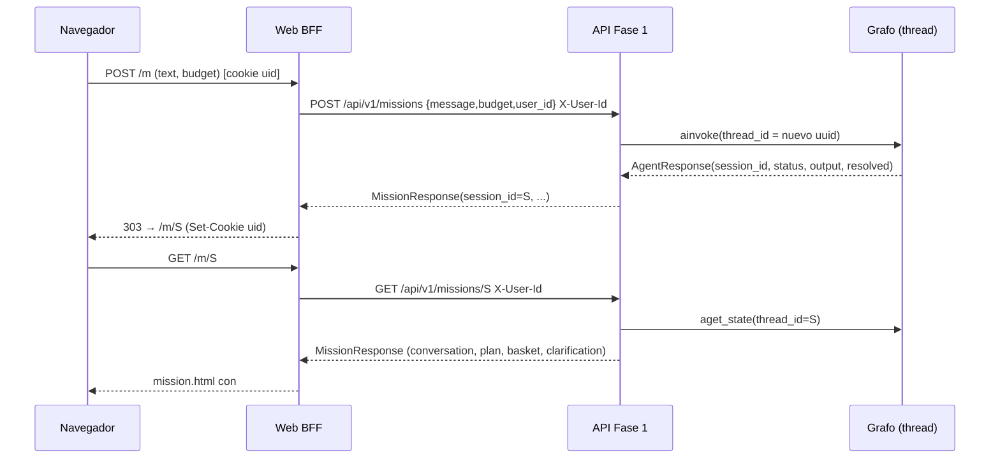
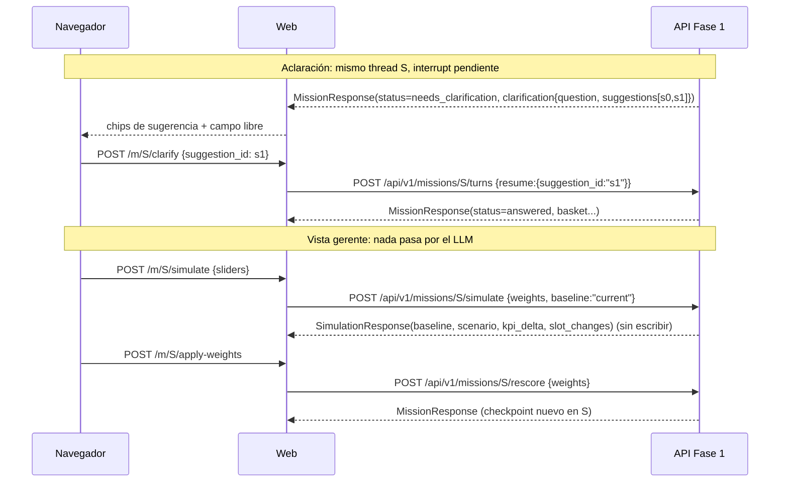

# Asesor de misión de compra: instrucciones para construir el MVP2 (web)

> **Cómo usar este archivo.** Es la continuación de `RESUMEN-MVP-FASE1.md`: se agrega al mismo `CLAUDE.md` o se pega a continuación.
> El MVP2 da por hecho que la **API JSON de la Fase 1 ya funciona**: agente LangGraph, filtros duros, score por objetivos, `/missions`, `/turns` y `/rescore`.
> Pedile a Claude Code las etapas **en orden** (§11) y verificá cada una en el navegador, también a 390 px de ancho.
>
> **Entregable del MVP2.** La página web del asesor, conectada a la Fase 1:
> 1. **Vista cliente.** Reproduce lo que ya existe: conversación, chips "Entendí tu necesidad", recomendaciones agrupadas por categoría, carrito inteligente con presupuesto, acciones rápidas y aclaraciones.
> 2. **Vista gerente (NUEVO).** Un toggle superpone, sobre la misma pantalla del cliente, controles de pesos del score. El gerente ve cómo cambia la recomendación y cómo se mueven los indicadores de **margen** y **beneficio esperado**.
> 3. **Un solo `session_id`** (= `thread_id` de LangGraph) identifica la sesión y la conversación de punta a punta.

---

## 1. Arquitectura

```
Navegador (HTML + HTMX)  ──HTML──►  Web BFF (FastAPI + Jinja)  ──JSON/HTTP──►  API Fase 1 (/api/v1)  ──►  Agente LangGraph + motor
        ▲                                   │                                        │
        └──── partial #advisor ◄── projector (MissionResponse → AdvisorVM)            └── checkpointer (thread_id = session_id)
```

- **El navegador NUNCA llama a la API de la Fase 1.** Habla sólo con la web (HTML sobre el cable, HTMX).
  La web, un *Backend For Frontend*, llama a la API **server-to-server**. Consecuencias:
  - Sin CORS y sin exponer datos de negocio al JS.
  - Un único lugar donde la sesión se traduce a `session_id` + `user_id`.
- **La web no tiene lógica de negocio.**
  - No filtra, no puntúa y no calcula margen: todo número de negocio viene calculado en el JSON de la Fase 1.
  - La web sólo **proyecta** (formatea, agrupa, decide CSS) y gestiona el **carrito**, que es estado de presentación.
- **Mismo repo, mismo proceso por defecto.**
  - La web usa un `Phase1Client` que en local, tests y un único contenedor va por `httpx.ASGITransport` contra la app FastAPI en memoria.
  - Si se despliega aparte, va por HTTP real a `PHASE1_BASE_URL`.
  - El contrato es el mismo en ambos casos: **JSON validado con Pydantic**.

### Reglas que se heredan y no se negocian
1. **Badges de procedencia:** `SIMULATED` es ámbar ("señal simulada"), `DERIVED` es gris ("estimado"), `REAL` va sin badge. También aplica a los KPIs de la vista gerente.
2. **Ausente ≠ cero.**
   - Sin presupuesto no hay barra ni "te quedan $0".
   - Sin margen, el KPI dice "sin dato" y muestra la cobertura, nunca "$0".
   - Una señal muerta aparece como "sin dato" en gris, no como un segmento de ancho 0 sin explicación.
3. **Citas:** texto literal recortado o "sin respaldo documental". La web nunca redacta.
4. **El LLM no ve productos.** Ninguna acción de la vista gerente pasa por el agente: sliders, simular y aplicar son deterministas (`/simulate`, `/rescore`).
5. **Sin build step de front.** Jinja + HTMX + Tailwind **vendorizados** en `app/static/`. Sin React, sin npm y sin CDN en runtime.
6. **Sin imágenes externas:** placeholder CSS por categoría, con la inicial del producto sobre un color.
7. **Sin autenticación ni cuentas.** El `uid` es un id anónimo en cookie. La vista gerente es un **modo demo** activado por flag, no un rol con login.
8. **Responsive 768 px nunca se corta.** El jurado abre la demo desde el celular. Los targets táctiles miden al menos 44 px.

---

## 2. Identidad: `session_id` = `thread_id` (la regla más importante)

| Identificador | Quién lo crea | Dónde vive | Para qué |
|---|---|---|---|
| `session_id` | **Sólo la Fase 1**, en `POST /api/v1/missions` (el agente asigna el `thread_id`) | URL de la web `/m/{session_id}` · path de toda llamada a la API · `configurable.thread_id` de LangGraph · doc `{prefix}_threads/{thread_id}` en Firestore | Identifica **la misión y su conversación**: plan, canasta, pesos, aclaración pendiente y mensajes |
| `user_id` | La web, la primera vez (`uuid4().hex`) | Cookie `uid` (httponly, samesite=lax, 1 año) → header `X-User-Id` en cada llamada a la API | Dueño de las sesiones · `list_sessions` · historial para `history_researcher` |
| `request_id` | La web, por request | Header `X-Request-Id` → logs de ambas capas | Correlación de logs; no es identidad |

### Reglas
1. **La web nunca inventa un `session_id`.** No hay `mission_id` propio ni ids aleatorios de pestaña: la URL **es** el thread.
2. **Todas las acciones sobre una misión usan el mismo `session_id`:** turno libre, respuesta a aclaración, acción rápida, rescore, simulación, toggle de vista y operaciones de carrito.
   **Sólo "Nueva misión"** (`POST /api/v1/missions`) crea un thread nuevo.
3. **REVISE no es START.**
   - Un ajuste ("somos 6") es `POST /missions/{sid}/turns` con `message`: el agente lo resuelve en el mismo thread con `mode=REVISE` y `previous_output` sacado del checkpoint.
   - Una respuesta a aclaración es `POST /missions/{sid}/turns` con `resume`: se usa `Command(resume=...)` sobre el **mismo** thread, que tiene el `interrupt` pendiente.
4. **Recarga, segundo dispositivo o instancia nueva:** `GET /missions/{sid}` reconstruye **todo** desde el checkpoint (conversación, plan, canasta, pesos, aclaración pendiente).
   La web no guarda nada de eso en memoria. Por eso ya no hacen falta ni la "recuperación desde semillas" ni `max-instances=1`, salvo por el carrito (§6).
5. **Propiedad.**
   - La API compara `X-User-Id` con el `user_id` del thread; si no coincide, devuelve **404**. Nunca 403, para no revelar que existe.
   - La web traduce 404 a una página "Tu sesión no existe o expiró", con enlace a nueva misión. Nunca un 500.
6. **Simular no escribe; aplicar sí.**
   - `POST /simulate` no toca el checkpoint.
   - `POST /rescore` escribe un checkpoint nuevo **en el mismo thread** (`graph.aupdate_state`). No crea un thread nuevo.
7. **Snapshot neutral.** Tras cada `ANSWERED`, la Fase 1 guarda en el thread `{mission_title, mission_kind, categories, needs, product_names}`, **sin precios ni margen**. La web no manda snapshots.
8. **Dos pestañas con la misma URL** comparten thread y carrito. Es aceptable y esperado.

### Flujos





---

## 3. Lo que la Fase 1 debe exponer para el MVP2 (delta de contrato)

Si la API de la Fase 1 no lo tiene todavía, **se agrega ahí**, no en la web. Todo es determinista y sin LLM, salvo `/turns`.

### 3.1 Headers y query comunes
- `X-User-Id` es **obligatorio** en toda ruta `/api/v1/missions*`. La API valida la propiedad del thread (§2, regla 5).
- `X-Request-Id` es opcional y se registra en los logs.
- `?view=manager` agrega los campos de negocio (`signals`, `kpis`, `trace` completo). Sin ese parámetro, la respuesta **omite** margen, conversión y demás señales: la vista cliente nunca recibe datos que no debe mostrar.

### 3.2 Cambios a `MissionResponse`

```python
class TurnOut(BaseModel):
    role: Literal["user", "assistant"]
    text: str
    detail: str | None = None          # "interpretado por el agente de IA" / "por palabras clave" / "desde caché"

class SignalOut(BaseModel):
    value: float | bool
    source: SignalSource               # real | derived | simulated

class ProductOut(BaseModel):           # (ya existía) + campos nuevos
    ...
    image_url: str | None = None
    unit: str | None = None
    citation: CitationOut | None = None             # snippet literal validado o None -> "sin respaldo documental"
    attribute_sources_derived: bool = False          # algún atributo se extrajo del nombre
    signals: dict[str, SignalOut] | None = None      # SÓLO con ?view=manager: margin_pct, conversion_rate, days_to_expiry, inventory_age_days, days_of_supply

class ScoredProductOut(BaseModel):     # (ya existía)
    product: ProductOut; total_score: float
    breakdown: list[ScoreComponent]    # signal, raw_value, normalized, weight_applied, contribution, source
    missing_signals: list[SignalName]; matches_preferred_brand: bool | None
    rank: int                          # 1 = picked, 2..4 = alternativas (orden del motor)

class BasketKpis(BaseModel):           # SÓLO con ?view=manager — calculado en la Fase 1, nunca en la web
    estimated_ticket: Decimal                 # Σ effective_price × qty de los picked
    items_count: int
    categories_covered: list[Category]
    gross_margin_amount: Decimal | None       # Σ effective_price × qty × margin_pct   (sólo líneas con margen)
    gross_margin_pct: float | None            # gross_margin_amount / ticket de las líneas con margen
    margin_coverage_pct: float                # % del ticket que tiene margen (0..100)
    expected_revenue: Decimal | None          # Σ effective_price × qty × conversion_rate
    expected_profit: Decimal | None           # Σ effective_price × qty × margin_pct × conversion_rate
    profit_coverage_pct: float                # % del ticket con margen Y conversión
    units_near_expiry: int | None             # Σ qty con days_to_expiry ≤ 7  (Reducir desperdicio)
    aged_units_moved: int | None              # Σ qty con inventory_age_days ≥ 90 o days_of_supply ≥ 60 (Mover inventario)
    avg_cart_affinity: float | None           # lift promedio de los picked contra el carrito
    data_source: SignalSource                 # SIMULATED si alguna señal usada lo es; si no, DERIVED si alguna lo es; si no, REAL

class BasketOut(BaseModel):            # (ya existía) + kpis
    ...
    preset: ScoringPreset | None; weights: ScoringWeights
    kpis: BasketKpis | None = None

class MissionResponse(BaseModel):      # (ya existía) + conversation
    session_id: str; status: AgentStatus; message: str
    produced_by: Literal["shortcut", "agent", "fallback", "rescore", "action"]
    plan: MissionPlan | None; basket: BasketOut | None
    clarification: ClarificationRequest | None
    conversation: list[TurnOut]        # reconstruida desde state["messages"] del thread
    trace: AgentTrace
```

**Reglas de los KPIs:**
- **Nunca se imputa** para un KPI monetario. La mediana imputada sirve para ordenar, no para reportar plata.
- Una línea sin margen **no suma** y baja `margin_coverage_pct`.
- Si ninguna línea tiene margen, `gross_margin_amount=None`: la UI dice "sin dato", no "$0".

### 3.3 Endpoints nuevos o ajustados

| Método | Ruta | Request | Response | Escribe checkpoint |
|---|---|---|---|---|
| GET | `/api/v1/missions/{sid}` | none | `MissionResponse` (con `conversation`) | no |
| POST | `/api/v1/missions/{sid}/rescore` | `{preset?, weights?, cart_product_ids?}` | `MissionResponse` (`produced_by="rescore"`) | **sí**: `resolved_output` + `weights` + turno "Ajusté los pesos…" |
| POST | `/api/v1/missions/{sid}/simulate` | `SimulateRequest` | `SimulationResponse` | **no** |
| POST | `/api/v1/missions/{sid}/actions` | `ActionRequest` | `MissionResponse` (`produced_by="action"`) | sí |
| GET | `/api/v1/sessions` | none (usa `X-User-Id`) | `list[SessionSummary{session_id,title,summary,updated_at}]` | no |

```python
class SimulateRequest(BaseModel):
    weights: ScoringWeights | None = None
    preset: ScoringPreset | None = None
    baseline: Literal["current", "balanceado", "relevancia_pura"] = "current"   # contra qué comparar
    cart_product_ids: list[str] = []                                            # para la señal de afinidad

class SlotChange(BaseModel):
    slot_id: str; slot_label: str
    baseline_pick: ScoredProductOut | None
    scenario_pick: ScoredProductOut | None
    changed: bool
    margin_delta: Decimal | None            # margen unitario × qty: scenario − baseline (None si falta dato)

class KpiDelta(BaseModel):
    ticket: Decimal; gross_margin_amount: Decimal | None; gross_margin_pct_points: float | None
    expected_profit: Decimal | None; items: int; picks_changed: int

class SimulationResponse(BaseModel):
    session_id: str
    baseline: BasketOut; scenario: BasketOut          # ambos con kpis
    kpi_delta: KpiDelta; slot_changes: list[SlotChange]

class ActionRequest(BaseModel):                       # comandos inequívocos: NUNCA pasan por el agente
    action: Literal["drop_category", "add_addon", "branded_only"]
    category: Category | None = None                  # drop_category
    addon_id: Literal["add_drinks"] | None = None     # add_addon
```

- **Implementación de `/simulate`:**
  1. Lee `domain_output` y los pesos actuales del thread.
  2. Llama dos veces a `basket_service.resolve_mission(plan, weights, ctx)`: una con el baseline y otra con el escenario.
  3. Calcula `compute_kpis(basket)` para cada uno y compara slot a slot.
  4. Es Python puro: responde en < 300 ms con el catálogo de unos 300 productos.
- **Los pesos cambian el ORDEN, nunca el filtro duro.** Un producto excluido no reaparece por subir un slider, y la web lo dice en el panel.

---

## 4. La web: estructura y cliente de la Fase 1

```
app/web/
  main_web.py          # (o se monta en app/main.py) router de páginas + static
  routes.py            # rutas HTML/HTMX (§5)
  client.py            # Phase1Client Protocol + AsgiPhase1Client + HttpPhase1Client
  identity.py          # cookie uid, view mode, X-Request-Id
  cart_store.py        # CartStore Protocol + InMemoryCartStore (TTL)
  copy.py              # labels, CSS por categoría/rol/señal, textos fijos
app/presentation/
  viewmodel.py         # contrato de la UI (dataclasses frozen) — §7
  projector.py         # MissionResponse (+SimulationResponse) + CartState -> AdvisorVM
  cart.py              # CartState + operaciones puras (add/set/remove/prune/cheaper_swaps)
app/templates/
  base.html index.html mission.html not_found.html
  partials/advisor_body.html conversation.html clarification.html understanding_chips.html
           recommendation_group.html product_card.html cart_panel.html cart_line.html
           budget_meter.html quick_actions.html turn_input.html
           manager_toggle.html manager_panel.html kpi_strip.html score_bar.html slot_changes.html
app/static/ htmx.min.js tailwind.js
```

**Regla de imports (con test por AST):**
- `app/web/` y `app/presentation/` **no importan** `app.agent`, `app.engine`, `app.services`, `app.repositories` ni `app.mission_agent`.
- Sólo pueden importar `app.api.models`, el contrato JSON, y sus enums.
- Si la web se despliega aparte, se copia ese módulo como paquete `contract`.

### 4.1 `Phase1Client`

```python
class Phase1Client(Protocol):
    async def create_mission(self, body: MissionCreate, *, user_id: str) -> MissionResponse: ...
    async def get_mission(self, session_id: str, *, user_id: str, manager: bool) -> MissionResponse: ...
    async def turn(self, session_id: str, body: TurnCreate, *, user_id: str, manager: bool) -> MissionResponse: ...
    async def rescore(self, session_id: str, body: RescoreRequest, *, user_id: str, manager: bool) -> MissionResponse: ...
    async def simulate(self, session_id: str, body: SimulateRequest, *, user_id: str) -> SimulationResponse: ...
    async def action(self, session_id: str, body: ActionRequest, *, user_id: str, manager: bool) -> MissionResponse: ...
    async def list_sessions(self, *, user_id: str) -> list[SessionSummary]: ...

class SessionNotFound(Exception): ...        # 404 de la API
class ClarificationConflict(Exception): ...  # 409
class Phase1Unavailable(Exception): ...      # timeout / 5xx / conexión
```

- **Implementación única, `HttpxPhase1Client(http: httpx.AsyncClient)`**:
  - Local, tests y mismo contenedor: `httpx.AsyncClient(transport=httpx.ASGITransport(app=api_app), base_url="http://phase1")`.
  - Despliegue separado: `httpx.AsyncClient(base_url=settings.phase1_base_url, timeout=60)`.
- **Comportamiento de cada llamada:**
  - Agrega `X-User-Id`, `X-Request-Id` y `?view=manager` cuando corresponde.
  - Valida la respuesta con `MissionResponse.model_validate(resp.json())`. **Si el JSON no valida, es un bug de contrato:** se registra y se lanza `Phase1Unavailable`.
  - Mapea 404 → `SessionNotFound`, 409 → `ClarificationConflict` y timeout/5xx → `Phase1Unavailable`.
- **Timeouts:** 60 s para `create_mission` y `turn` (hay LLM de por medio); 10 s para lo demás.
- **Fake para tests:** `FakePhase1Client` guarda cada llamada con su `session_id` y `user_id` y devuelve fixtures JSON de `tests/web/fixtures/*.json`.

### 4.2 Qué pasa con cada error en la UI

| Error | Página completa | Mutación HTMX |
|---|---|---|
| `SessionNotFound` | `not_found.html` (404) | partial `session_expired.html` |
| `Phase1Unavailable` | aviso ámbar "No pude contactar al asesor; intenta de nuevo" + la última vista si existe | mismo aviso en `vm.notices`; la canasta no cambia |
| `ClarificationConflict` | recarga con `GET` y muestra el estado real | idem |

---

## 5. Rutas de la web (`app/web/routes.py`)

Todas las mutaciones HTMX devuelven **el mismo partial** `partials/advisor_body.html` con el `AdvisorVM` completo y reemplazan `#advisor` entero. Así dos regiones de la pantalla no pueden desincronizarse.

| Método | Ruta | Llama a la Fase 1 | Qué hace |
|---|---|---|---|
| GET | `/` | `list_sessions` (opcional) | Formulario "¿Qué necesitas resolver?" + chips semilla + presupuesto opcional + "Tus misiones recientes" |
| POST | `/m` | `create_mission` | 303 → `/m/{session_id}` y setea la cookie `uid` |
| GET | `/m/{sid}` | `get_mission` | Página completa `mission.html`. Si no hay carrito en el `CartStore`, arma el default con los picked × `slot.quantity` y avisa |
| POST | `/m/{sid}/turn` | `turn(message)` | Ajuste en texto libre |
| POST | `/m/{sid}/clarify` | `turn(resume)` | `suggestion_id` desde un chip, o `free_text` |
| POST | `/m/{sid}/action` | `action(...)` | `drop_category:<cat>`, `add_drinks`, `branded_only` |
| POST | `/m/{sid}/cart/{op}` | none | `add`/`inc`/`dec`/`remove` sobre el `CartStore`, más `prune` contra la canasta vigente (la re-lee con `get_mission`) |
| POST | `/m/{sid}/optimize-price` | none | `cheaper_swaps` dentro del pool visible, sólo del carrito |
| POST | `/m/{sid}/improve-quality` | `rescore(preset=relevancia_pura)` | Reordena por relevancia pura y resetea el carrito al default |
| POST | `/m/{sid}/view` | `get_mission(manager=...)` | Toggle cliente/gerente: cookie `view` + re-render |
| POST | `/m/{sid}/simulate` | `simulate` | Sólo en modo gerente; re-render con el escenario superpuesto |
| POST | `/m/{sid}/apply-weights` | `rescore(weights)` | Persiste los pesos en el thread; reconcilia el carrito |
| POST | `/m/{sid}/reset-weights` | `rescore(preset=balanceado)` | Vuelve a los pesos por defecto |

**Estado de la vista gerente entre requests:**
- Los sliders viajan en cada `POST /simulate` como campos del form, con `hx-include="#manager-panel"`.
- El escenario simulado **no se guarda** en ningún lado: se recalcula en cada request.
- La cookie `view=manager|client` (httponly, samesite=lax, sesión de navegador) sólo recuerda el modo.
- Todo se ignora si `ENABLE_MANAGER_VIEW=false`: la ruta devuelve 404 y el toggle no se pinta.

---

## 6. Carrito: estado de presentación, sin persistencia

- **Qué guarda:** el carrito no guarda productos ni precios. Guarda `CartLine(slot_id, product_id, quantity)` y se resuelve siempre contra la **canasta vigente** del thread. El precio mostrado es el actual, nunca uno congelado.
- **Estado inicial:** el carrito arranca **lleno** con el `picked` de cada slot × `slot.quantity`. Arrancar vacío obligaría a 7 clics antes de ver el valor.
- **Pool visible:** `picked` + alternativas, truncado a `CARDS_PER_SLOT = 3`. El carrito, "Optimizar precio" y los roles trabajan **sólo** sobre ese pool, para que "dentro de las opciones que te mostré" sea verdad.
- **`CartStore` Protocol:** `get(session_id) -> CartState | None`, `put(session_id, state)`, `drop(session_id)`.
  - `InMemoryCartStore` con TTL de 1 h y `threading.Lock`, indexado **por `session_id`**, el mismo del thread.
  - Si el carrito se pierde (TTL o reinicio), se reconstruye con el default y la UI avisa: "Reinicié tu carrito con la selección recomendada".
  - Con varias instancias en Cloud Run se usa sticky sessions o se acepta ese aviso. El carrito **no** va a Firestore: no hay carrito persistente.
- **Operaciones puras:** `add`, `set_quantity`, `remove`, `replace_product`, `prune(state, basket) -> (state, dropped_ids)`, `default_from_basket`, `cheaper_swaps(state, basket) -> list[PriceSwap(saving × qty)]` y `apply_swaps`.
- **Reconciliar después de todo cambio de canasta** (turn, action, rescore, apply-weights):
  1. `prune` de las líneas huérfanas.
  2. Agregar el `picked` a cada slot sin línea.
  3. Anunciar en `notices` cuántas líneas se quitaron. Nunca desaparecen en silencio.
- **Afinidad:** en `/simulate` y `/rescore` la web manda `cart_product_ids`, los ids del carrito actual, para que la señal de afinidad refleje lo que el cliente ya tiene.

---

## 7. Contrato de la UI (`app/presentation/viewmodel.py`)

**Reglas:**
- Dataclasses `frozen`, no Pydantic: es salida interna.
- Todo lo que imprime una plantilla llega **ya formateado**: `Money.display`, labels humanos y clases CSS resueltas. **Jinja no decide nada.**
- Si una plantilla necesita un dato que no está, se agrega al VM y lo llena el proyector.

### 7.1 Lo existente (vista cliente)

```python
RoleTag = Literal["essential", "recommended", "cheapest", "complementary"]
BadgeKind = Literal["simulated", "derived", "availability", "promo"]

@dataclass(frozen=True) class Money: amount: Decimal; display: str                       # "$ 1,234.50"
@dataclass(frozen=True) class BadgeVM: kind: BadgeKind; text: str; css: str; title: str | None = None
@dataclass(frozen=True) class CitationVM: has_support: bool; snippet: str | None = None; doc_title: str | None = None; locator: str | None = None
@dataclass(frozen=True) class ReasonVM: text: str; source: Literal["slot_rationale", "slot_label"]; citation: CitationVM
@dataclass(frozen=True) class ImageVM: url: str | None; initial: str; css: str
@dataclass(frozen=True) class ProductCardVM:
    key: str                     # f"{slot_id}:{product_id}" — id DOM estable entre swaps
    slot_id: str; product_id: str; name: str; brand: str | None
    price: Money; price_before: Money | None       # tachado sólo si hay promo
    image: ImageVM; role: RoleTag; role_label: str; role_css: str
    reason: ReasonVM; availability_label: str; availability_css: str
    add_endpoint: str; badges: tuple[BadgeVM, ...] = ()
    in_cart: bool = False; cart_quantity: int = 0; requested_brand: bool = False
    manager: "CardManagerVM | None" = None          # NUEVO: sólo en vista gerente (§7.2)
@dataclass(frozen=True) class RecommendationGroupVM: category_value: str; title: str; subtitle: str; icon: str; css: str; cards: tuple[ProductCardVM, ...]
@dataclass(frozen=True) class ChipVM: text: str; kind: str; icon: str | None = None       # group|budget|context|vehicle|exclusion|brand|kind
@dataclass(frozen=True) class TurnVM: role: Literal["user", "assistant"]; text: str; detail: str | None = None
@dataclass(frozen=True) class ClarificationVM: question: str; suggestions: tuple[tuple[str, str], ...]; allow_free_text: bool; endpoint: str   # (id, label)
@dataclass(frozen=True) class CartLineVM: key: str; slot_id: str; product_id: str; name: str; unit_price: Money; quantity: int; line_total: Money
                                         inc_endpoint: str; dec_endpoint: str; remove_endpoint: str; badges: tuple[BadgeVM, ...] = ()
@dataclass(frozen=True) class CartGroupVM: category_value: str; title: str; icon: str; lines: tuple[CartLineVM, ...]; subtotal: Money
@dataclass(frozen=True) class BudgetVM: has_budget: bool; spent: Money; message: str; short_message: str = ""; total: Money | None = None
                                       remaining: Money | None = None; is_over: bool = False; percent: int = 0; bar_css: str = ""
@dataclass(frozen=True) class CartVM: is_empty: bool; items_count: int; subtotal: Money; budget: BudgetVM; groups: tuple[CartGroupVM, ...] = ()
@dataclass(frozen=True) class QuickActionVM: action_id: str; label: str; endpoint: str; icon: str | None = None; hint: str | None = None
                                            enabled: bool = True; disabled_reason: str | None = None
@dataclass(frozen=True) class AdvisorVM:
    session_id: str; title: str; cart: CartVM; currency_symbol: str
    conversation: tuple[TurnVM, ...] = (); clarification: ClarificationVM | None = None
    chips: tuple[ChipVM, ...] = (); groups: tuple[RecommendationGroupVM, ...] = ()
    wow_actions: tuple[QuickActionVM, ...] = (); refine_actions: tuple[QuickActionVM, ...] = ()
    notices: tuple[str, ...] = (); covered_categories: tuple[str, ...] = ()
    view_toggle: "ViewToggleVM | None" = None       # NUEVO
    manager: "ManagerPanelVM | None" = None         # NUEVO: None en vista cliente
```

**Reglas del proyector que hay que conservar (vista cliente):**
- **`derive_role(slot, sp)`**, con precedencia estricta:
  1. Una alternativa que es la más barata del pool (desempate por mayor score) es "Más económico". El `picked` nunca lo es.
  2. Cualquier otra alternativa es "Complementario".
  3. Un `picked` de slot opcional o con `priority ≥ 4` es "Complementario".
  4. Un `picked` con `priority == 1` es "Esencial".
  5. El resto de los `picked` son "Recomendado".
- **`derive_reason`:** usa `slot.rationale`, que habla de la misión ("por qué lo necesitas"). Si no hay, usa la plantilla fija `"Cubre «{label}» de tu misión."`. La cita va **aparte**; sin cita, "sin respaldo documental".
- **Badges de la tarjeta:** "señal simulada" (ámbar) si alguna señal es `SIMULATED`, que gana sobre `DERIVED`; "estimado" (gris) si alguna es `DERIVED` o hay un atributo derivado. `REAL` va sin badge.
- **Grupos:**
  - El orden de categorías es el de primera aparición en los slots del plan (respeta la prioridad). No es alfabético.
  - Los slots no resueltos no generan tarjetas.
  - Las tarjetas respetan el orden del motor.
- **Chips "Entendí tu necesidad"** (máximo 6, orden fijo, sin LLM):
  1. personas
  2. presupuesto
  3. exclusiones ("Sin autos")
  4. marcas pedidas
  5. destino ("Viaje a {destino}" si es TRIP)
  6. ocasión
  7. transporte
  8. con niños
  9. vehículo

  Sólo se muestran los que aplican y se cortan en 6. Si no hay ninguno, un chip con el tipo de misión. Nunca "0 personas" ni "Presupuesto: —".
- **Presupuesto:**
  - Sin presupuesto: "Sin presupuesto declarado.", sin barra.
  - Con presupuesto: barra verde, ámbar desde el 90% y roja si se pasa, con "Te quedan $X de tu presupuesto de $Y" o "Te pasaste por $X".
- **Acciones WOW** (en el carrito). Se **deshabilitan explicando por qué**, nunca se ocultan:
  - "Optimizar precio": se deshabilita si no hay swaps más baratos ("Ya tienes la opción más económica de cada ítem").
  - "Mejorar calidad": se deshabilita si los pesos ya son `relevance ≥ 0.999` ("Ya está ordenado por relevancia pura").
- **Acciones de refinamiento:** "Quiero opciones más baratas" (= optimizar precio), "Quita productos de {categoría}" (sólo si hay ≥ 2 categorías), "Agrega bebidas" y "Sólo productos de marca".
- **Respuesta del asistente:** la arma la Fase 1 con contadores reales ("Te muestro 3 opciones de bloqueador en Supermercado. Por ahora no tengo llantas en stock."). La web sólo la muestra junto a `detail` ("interpretado por el agente de IA").
- **Aclaración:**
  - La pregunta se muestra como burbuja del asistente, con **chips** por sugerencia (`hx-post /m/{sid}/clarify`, `suggestion_id`) y un campo de texto libre si `allow_free_text`.
  - Mientras hay una aclaración pendiente, el input de turno manda a `/clarify` en lugar de `/turn`.
  - Un número ("2") también elige la sugerencia 2.

### 7.2 Lo nuevo (vista gerente)

```python
SignalName = Literal["relevance", "profitability", "conversion", "waste", "inventory", "affinity"]

@dataclass(frozen=True) class ViewToggleVM:
    is_manager: bool; endpoint: str                  # POST /m/{sid}/view
    label_client: str = "Vista cliente"; label_manager: str = "Vista gerente"

@dataclass(frozen=True) class SliderVM:
    name: SignalName; label: str; value: float; min: float = 0.0; max: float = 0.5; step: float = 0.05
    color_css: str; help: str                         # "Prioriza productos con mayor margen bruto"

@dataclass(frozen=True) class ScoreSegmentVM:
    signal: SignalName; label: str; width_pct: float  # contribution / total_score × 100
    css: str; title: str                              # "Rentabilidad: normalizado 0.82 × peso 0.18 = 0.148 (simulado)"
    source_badge: BadgeVM | None

@dataclass(frozen=True) class ScoreBarVM:
    total_display: str                                # "0.735"
    segments: tuple[ScoreSegmentVM, ...]
    missing: tuple[str, ...]                          # labels de señales muertas: "Desperdicio: sin dato"

@dataclass(frozen=True) class RankChangeVM:
    text: str; css: str                               # "↑ 2" verde · "↓ 1" rojo · "nuevo" azul · "=" gris

@dataclass(frozen=True) class CardManagerVM:
    score: ScoreBarVM
    rank_change: RankChangeVM | None                  # vs baseline; None si no hay simulación
    margin_pct: str | None                            # "31 %" o None -> "sin dato"
    margin_unit: Money | None
    signal_badges: tuple[BadgeVM, ...]

@dataclass(frozen=True) class KpiVM:
    label: str                                        # "Margen bruto"
    baseline: str; scenario: str | None               # scenario None si no hay simulación activa
    delta: str | None; delta_css: str                 # "+$ 12.40" verde / "−0.8 pp" rojo / gris si 0
    coverage_note: str | None                         # "sobre 82 % del ticket"
    badge: BadgeVM | None                             # ámbar si data_source = simulated

@dataclass(frozen=True) class SlotChangeVM:
    slot_label: str; before: str; after: str; before_score: str; after_score: str
    margin_delta: str | None; changed: bool

@dataclass(frozen=True) class ManagerPanelVM:
    presets: tuple[tuple[str, str, bool], ...]        # (value, label, selected)
    sliders: tuple[SliderVM, ...]
    relevance_weight: str                             # "Relevancia: 0.35 (piso 0.20)"
    floor_active: bool
    kpis: tuple[KpiVM, ...]
    slot_changes: tuple[SlotChangeVM, ...]
    is_simulating: bool                               # hay escenario distinto del aplicado
    simulate_endpoint: str; apply_endpoint: str; reset_endpoint: str
    notes: tuple[str, ...]                            # "Los pesos cambian el orden, no el filtro duro." · "KPIs sobre datos simulados."
    trace: tuple[tuple[str, str], ...]                # ("Interpretado por", "agente de IA"), ("Modelos", "planner: claude-sonnet-5"), ("Iteraciones", "2")
```

**Colores por señal** (constantes en `copy.py`, las mismas en sliders, segmentos y leyenda):

| Señal | Label | Color |
|---|---|---|
| relevance | Relevancia | `bg-slate-500` |
| profitability | Rentabilidad | `bg-emerald-500` |
| conversion | Conversión | `bg-blue-500` |
| waste | Reducir desperdicio | `bg-orange-500` |
| inventory | Mover inventario | `bg-violet-500` |
| affinity | Afinidad con carrito | `bg-pink-500` |

---

## 8. La vista gerente en detalle

### 8.1 Qué ve el gerente al activar el toggle

Es la **misma pantalla del cliente** con capas agregadas. No es otra página: el gerente ve exactamente lo que ve el cliente, más el "por qué" comercial.

1. **Toggle** en el header, con un segmented control "Vista cliente | Vista gerente".
   `hx-post="/m/{sid}/view"` con `hx-vals='{"mode":"manager"}'`. Visible sólo si `ENABLE_MANAGER_VIEW=true`.
2. **Panel "Pesos del score"**, arriba de las recomendaciones:
   - Selector de preset con 7 opciones: balanceado, rentabilidad, conversión, desperdicio, inventario, afinidad y relevancia pura. Elegir un preset carga sus pesos en los sliders.
   - **5 sliders** de 0 a 0.50 con paso 0.05: Rentabilidad, Conversión, Reducir desperdicio, Mover inventario y Afinidad con carrito.
   - Relevancia calculada y de sólo lectura: `max(0.20, 1 − Σ sliders)`. Muestra "piso activo" cuando corresponde.
   - Simulación en vivo: `<form id="manager-panel" hx-post="/m/{sid}/simulate" hx-trigger="input changed delay:400ms from:input[type=range], change from:select">`.
   - Botones:
     - **Aplicar a la sesión** (`/apply-weights`): el cliente pasa a ver ese orden.
     - **Restablecer** (`/reset-weights`).
     - **Descartar simulación:** vuelve a `GET` en modo gerente.
3. **Tira de KPIs**, en formato "Actual → Simulado (Δ)":

   | KPI | Fuente | Formato |
   |---|---|---|
   | Ticket estimado | `kpis.estimated_ticket` | Money; Δ verde si sube |
   | Margen bruto $ | `gross_margin_amount` | Money o "sin dato" + "sobre X % del ticket" |
   | Margen bruto % | `gross_margin_pct` | "31.2 %"; Δ en puntos porcentuales |
   | Beneficio esperado | `expected_profit` | Money o "sin dato" + cobertura |
   | Ítems por canasta | `items_count` | entero |
   | Unidades próximas a vencer que salen | `units_near_expiry` | entero o "sin dato" |
   | Unidades de inventario envejecido que salen | `aged_units_moved` | entero o "sin dato" |
   | Productos que cambiaron | `kpi_delta.picks_changed` | "3 de 7 necesidades" |

   - Badge ámbar "señal simulada" en cada KPI si `data_source = simulated`.
   - Nota fija: *"Indicadores calculados sobre la canasta recomendada (producto elegido × cantidad), no sobre el carrito editado por el cliente."*
4. **Sobre cada tarjeta** (`card.manager`):
   - Barra apilada del score: un segmento por señal viva, con ancho = `contribution / total_score`. El tooltip muestra "normalizado × peso = contribución (fuente)".
   - Score total.
   - Chip de cambio de rank frente al baseline: ↑2, ↓1, "nuevo en top" o "=".
   - Margen % y margen por unidad, o "sin dato".
   - Leyenda de señales muertas: "Desperdicio: sin dato (no perecible)".
5. **"Qué cambió"** (lista colapsable): una fila por slot con `antes → después`, score antes/después y Δ de margen. Los slots sin cambio van atenuados.
6. **Excluidos por filtro duro** (colapsable por slot): `rejected` con su motivo en lenguaje humano ("Sin stock en este momento", "No compatible con el vehículo indicado"), más la nota *"Subir un peso no recupera productos excluidos."*
7. **Traza** (pie del panel): `produced_by`, `interpreted_by`, `models_used`, `iterations` y `retries`, sacados de `trace`.

### 8.2 Qué NO cambia
- **El carrito del cliente no cambia al simular.** Sólo cambia al **Aplicar**, y ahí se reconcilia (§6).
- **Las tarjetas de la vista cliente** conservan su orden aplicado hasta Aplicar. En modo gerente, las tarjetas muestran el **escenario simulado**, con el chip de rank marcando la diferencia.
- **El plan (slots) no cambia:** los pesos sólo reordenan dentro de cada slot.

### 8.3 Proyección
`project_advisor(mission: MissionResponse, cart: CartState, *, manager: bool, simulation: SimulationResponse | None, sliders: ScoringWeights | None) -> AdvisorVM`

- **Sin simulación:**
  - Tarjetas y carrito salen de `mission.basket`.
  - Si `manager`, `kpis.baseline` sale de `mission.basket.kpis` y `scenario=None`.
- **Con simulación:**
  - Tarjetas de `simulation.scenario`.
  - `rank_change` comparando el rank del producto en `baseline` contra `scenario` dentro del slot.
  - KPIs de `baseline.kpis` → `scenario.kpis` con `kpi_delta`.
  - `slot_changes` de `simulation.slot_changes`.
- **El carrito siempre se proyecta contra `mission.basket`**, la canasta aplicada, nunca contra el escenario.
- **Formato de los deltas:** Money con signo; porcentajes con 1 decimal y "pp"; `None` se muestra como "sin dato", gris, sin flecha.

---

## 9. Plantillas y responsive

- **`mission.html`:** header con "← Nueva misión", el toggle y un spinner `htmx-indicator`. `#advisor` lleva `hx-target="#advisor" hx-swap="innerHTML" hx-indicator="#advisor-spinner" aria-live="polite"`, que heredan todos los botones.
- **`advisor_body.html`:**
  - **Desktop (≥ 768 px):** `md:grid-cols-[minmax(0,2fr)_minmax(0,1fr)]`.
    - Columna izquierda: avisos → conversación → aclaración → chips → **panel gerente** (si aplica) → grupos de recomendación → "¿Quieres que lo ajuste?" → input de turno *sticky*.
    - Columna derecha: carrito *sticky* con presupuesto y acciones WOW.
  - **Móvil:**
    - Una columna, con el carrito como `<details>` fijo abajo (resumen "🛒 N ítems · $X · Quedan $Y ▴") que se despliega a 75 vh. Sin JS.
    - El panel gerente es un `<details open>` colapsable. Los sliders van a ancho completo y los KPIs en grilla de 2 columnas.
    - El input de turno queda `sticky bottom-20` para no tapar el carrito.
- **Tarjetas:** grilla `grid-cols-1 sm:grid-cols-2 xl:grid-cols-3`. Botón "🛒 Agregar" a ancho completo, que pasa a "✓ En carrito (n) · +1". Borde verde si está en el carrito.
- **Accesibilidad:** `aria-label` en los botones de ícono (−, +, 🗑); `role="progressbar"` con `aria-valuenow` en el presupuesto; `<label>` en cada slider con su valor visible (`<output>`).
- **Base:** `<script src="/static/tailwind.js">` y `<script src="/static/htmx.min.js">`. CSS mínimo para `.htmx-indicator`.

---

## 10. Configuración y wiring

```dotenv
PHASE1_MODE=asgi                 # asgi (mismo proceso) | http
PHASE1_BASE_URL=http://localhost:8000   # sólo si PHASE1_MODE=http
ENABLE_MANAGER_VIEW=true
CART_TTL_SECONDS=3600
USER_COOKIE=uid
```

- **`app/main.py`:**
  1. Monta el router de la API (`/api/v1`) y el router web (`/`), más `StaticFiles("/static")`.
  2. En `lifespan`, crea el `AgentService` y los repos (Fase 1), y además `app.state.phase1 = HttpxPhase1Client(...)` (ASGI contra la propia app, o HTTP) y `app.state.carts = InMemoryCartStore(ttl)`.
  3. Al cerrar, `await phase1.aclose()`.
- **`deps.py` de la web:** `get_phase1`, `get_carts`, `get_identity(request) -> Identity(user_id, is_new, view_mode, request_id)`.
- **Cookies:** las rutas escriben `uid` en la respuesta si `is_new`.

---

## 11. Plan por etapas

**Rebanada vertical primero:** una misión semilla renderizada con datos reales de la API, una tarjeta con badge `SIMULATED` y el estado "sin respaldo documental". Recién después, el resto.
**Después de cada etapa se abre en el navegador**, en desktop y en 390 px. No se asume que funciona leyendo el diff.

| Etapa | Entregable | Verificación | Tiempo |
|---|---|---|---|
| **W0** Contrato de API | Delta de §3 en la Fase 1: `conversation`, `?view=manager`, `BasketKpis` + `compute_kpis`, `X-User-Id` + 404 por dueño, `/simulate`, `/actions`, `GET /sessions` | tests API: dueño distinto → 404; `simulate` no cambia el `GET`; KPI sin margen → `None` y cobertura 0; cliente sin `view` no recibe `signals` | 50 min |
| **W1** Cliente + identidad | `Phase1Client` (httpx ASGI/HTTP) + fake + fixtures; `identity.py` (uid, request_id); `CartStore` | test: `create` → `session_id` S; todas las llamadas posteriores del fake usan S y el mismo `user_id` | 25 min |
| **W2** Páginas base | `base.html` + `index.html` (chips semilla, presupuesto) + `POST /m` (303) + `GET /m/{sid}` + `not_found.html` | navegador: crear misión → URL `/m/{session_id}`; recargar muestra lo mismo | 25 min |
| **W3** Vista cliente ⭐ | `viewmodel.py` + `projector.py` (§7.1) + conversación, chips, grupos, tarjetas (rol, razón, cita, badges, disponibilidad), carrito (líneas, subtotal por categoría, presupuesto), `cart/{op}` | tests puros del proyector con fixtures JSON: badge simulado gana a derivado; sin presupuesto no hay barra; roles; pool de 3 · navegador desktop + 390 px | 60 min |
| **W4** Conversación | `/turn`, `/clarify` (chips + texto libre + número), `/action`, `optimize-price`, `improve-quality`, reconciliación del carrito con avisos | test: `needs_clarification` → chip s1 → `resume` con el mismo S → `answered`; optimizar precio con ahorro × qty | 40 min |
| **W5** Toggle + score en tarjetas | `ViewToggleVM`, cookie `view`, `?view=manager`, `ScoreBarVM`, margen por tarjeta, señales muertas "sin dato", traza | test: el toggle no cambia S; en vista cliente el HTML no contiene "margen" ni "score" | 30 min |
| **W6** Simulación ⭐ wow | `manager_panel.html` (preset + 5 sliders + relevancia con piso), `/simulate` en vivo, `kpi_strip.html`, `RankChangeVM`, `slot_changes.html`, excluidos | test: preset "rentabilidad" → `gross_margin_amount` escenario ≥ baseline en fixture; el carrito no cambia al simular · navegador: mover slider → KPIs y chips de rank cambian | 50 min |
| **W7** Aplicar + pulido | `/apply-weights`, `/reset-weights`, reconciliación, "Tus misiones recientes" en index, `session_expired.html`, estados de error `Phase1Unavailable` | navegador: aplicar → vista cliente con el nuevo orden; otra pestaña con la misma URL ve lo mismo | 30 min |

- **Orden de corte**, si falta tiempo: "misiones recientes" (W7) → excluidos y traza del panel (W6) → `/actions` (W4, que se reemplaza por texto libre) → presets (W6, se dejan sólo los sliders).
- **Nunca se cortan:** W0–W3, el toggle con score en tarjetas (W5), los sliders con KPIs (W6) y el responsive.

### Prompts sugeridos para Claude Code
- **W0:** "Implementá §3 de RESUMEN-MVP2 en la API de la Fase 1: `compute_kpis` sin imputar, `/simulate` sin escribir checkpoint, validación de `X-User-Id` con 404. Tests primero."
- **W3:** "Implementá §7.1 y las plantillas de §9 para la vista cliente, proyectando desde `MissionResponse`. Tests puros del proyector con fixtures JSON reales capturados de la API. Después abrí `/m/{sid}` y mostrame el HTML de una tarjeta."
- **W6:** "Implementá §8 completo. La simulación no toca el carrito ni el checkpoint. Verificá en 390 px que el panel y los KPIs se leen sin scroll horizontal."

---

## 12. Tests que protegen las costuras

- **Identidad:**
  - `test_session_id_es_el_mismo_en_todas_las_llamadas`: create → turn → clarify → simulate → apply → cart. El `FakePhase1Client` registra un único `session_id`.
  - `test_web_nunca_genera_session_id`: grep por AST de `uuid` fuera de `identity.py`.
  - `test_usuario_distinto_da_404` (API) y `test_404_renderiza_session_expired` (web).
- **Separación de capas:**
  - `test_web_no_importa_motor_ni_agente` (AST sobre `app/web` y `app/presentation`).
  - `test_vista_cliente_no_recibe_senales`: la respuesta sin `view=manager` no trae `signals` ni `kpis`.
- **Vista gerente:**
  - `test_simulate_no_modifica_estado`: `GET` antes y después de `/simulate` es idéntico.
  - `test_kpi_sin_margen_es_sin_dato`: `None` se muestra como "sin dato" y nunca aparece "$ 0.00".
  - `test_rank_change`: un producto que pasa de alternativa 3 a picked muestra "↑ 2".
  - `test_segmentos_suman_100`: Σ `width_pct` de las señales vivas ≈ 100.
  - `test_pesos_no_recuperan_excluidos`: un producto excluido en baseline sigue excluido en el escenario con cualquier peso.
- **Carrito:** `prune` tras apply; `cheaper_swaps` sólo dentro del pool visible y con ahorro × cantidad; carrito perdido → default + aviso.
- **Proyector (sin red, fixtures JSON):**
  - El badge simulado gana a derivado.
  - Sin presupuesto no hay barra.
  - Roles con su precedencia.
  - Chips en orden fijo y tope 6.
  - Botones deshabilitados con motivo.
