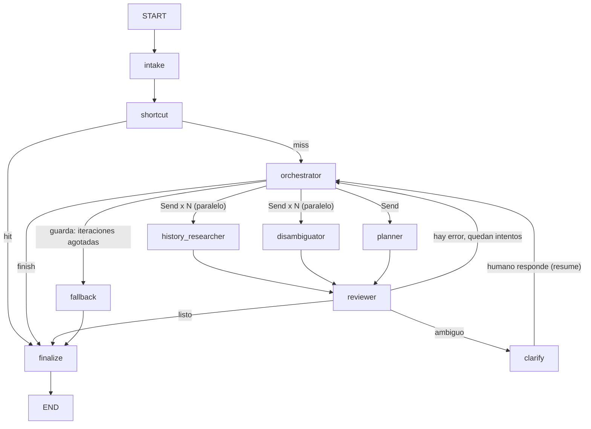

# `app/agent/` — Módulo de Agente de IA (LangGraph)

Un agente de IA genérico, reutilizable, construido sobre [LangGraph](https://langchain-ai.github.io/langgraph/).
No sabe nada de "misiones de compra" ni de retail — eso lo aporta un **plugin de
dominio** que el proyecto anfitrión escribe (en este repo: `app/mission_agent/`).

**Para copiarlo a otro proyecto:** copiá este directorio completo, escribí un
`AgentDomain` nuevo (ver abajo) y construí un `AgentService` con él. Nada más
de acá cambia.

## Por qué existe esta separación

```
tu_app/routes.py ──► tu_app/<dominio>/bridge.py ──► app/agent (AgentService)
    (tu framework web)   (traduce tu modelo <-> AgentRequest)   (genérico, copiable)
                            └─ TuDomain: output_model, shortcut,
                               fallback, summarize_snapshot
```

`app/agent/` no importa nada fuera de sí mismo (ver `tests/agent/test_module_is_portable.py`,
que lo verifica con un chequeo AST en CI). Todo lo que sabe del "afuera" entra
por dos puntos:

1. **`contracts.py`** — `AgentRequest` / `AgentResponse`: el único lenguaje
   con el que un anfitrión le habla al agente. Nunca un tipo de LangGraph
   cruza esta frontera.
2. **`domain.py`** — el `Protocol` `AgentDomain` que el anfitrión implementa
   para decirle al agente qué forma tiene su resultado y cómo comportarse
   sin LLM.

## Qué resuelve

- **Memoria por sesión, sólo vía checkpoints de LangGraph.** No hay una tabla
  paralela de "historial de conversación" — el checkpoint DE LangGraph *es*
  la memoria. `persistence/` desacopla QUÉ base de datos la guarda (memoria
  de proceso para tests/dev, Cloud Firestore para producción) de CÓMO
  LangGraph la usa.
- **Un orquestador que despacha subagentes en paralelo** (`Send` de
  LangGraph): un investigador de historial (usa tools para leer sesiones
  pasadas del mismo usuario) y un desambiguador, al mismo tiempo, cuando hace
  falta.
- **Human-in-the-loop real** (`interrupt()`/`Command(resume=...)`): si el
  pedido requiere un dato imprescindible, el grafo se pausa y espera una
  respuesta humana. Formula una pregunta concreta (`question` del
  desambiguador o `clarification_question` del revisor); usa opciones sólo
  cuando ayudan a resolverla. Un pedido amplio puede pasar directo al plan.
- **Desacople de qué LLM usa cada rol**, y en qué nivel de capacidad
  (`STANDARD` / `REASONING`). El orquestador puede escalar el nivel de UN
  subagente por UN turno cuando el revisor detecta que el problema es de
  razonamiento, no de instrucción.
- **Resiliencia clasificada, no reintento ciego**: 429/5xx/timeouts se
  reintentan con backoff; un 400 o una salida inválida dispara
  re-planificación (instrucción distinta, no la misma llamada de nuevo); un
  401/403 corta directo a una respuesta de resguardo.
- **Control de loop explícito**: tope de iteraciones, tope de intentos por
  subagente, tope de clarificaciones — todos en Python, nunca confiados al
  LLM. Agotado cualquiera, el dominio da la mejor respuesta posible
  (`AgentDomain.fallback`, que NUNCA puede fallar).

## El grafo



- **`intake`**: abre el turno — registra el mensaje, resetea contadores.
- **`shortcut`**: atajo determinista del dominio (p. ej. una caché de
  respuestas conocidas). Cero LLM si pega.
- **`orchestrator`** (LLM): decide investigar, planificar o terminar.
  VALIDA en Python lo que el LLM propuso antes de guardarlo — filtra tareas
  que ya agotaron sus intentos, fuerza el fallback si se acabaron las
  iteraciones.
- **`history_researcher`** (LLM + tools): busca en sesiones pasadas del
  mismo usuario.
- **`disambiguator`** (LLM): evalúa si el pedido es lo bastante claro.
- **`planner`** (LLM): produce la salida final (`AgentDomain.output_model`).
- **`reviewer`** (Python determinista + LLM): valida la salida del planner
  contra su schema de verdad (nunca le pregunta al LLM si "parece válida"),
  decide si alcanza para terminar, si hay que re-planificar, o si el pedido
  sigue siendo ambiguo.
- **`clarify`**: `interrupt()` — pausa real del grafo. Al reanudar registra
  pregunta, opciones y respuesta como conversación; reconoce tanto IDs como
  selecciones en texto ("3", "opción 3", "del tipo 3"). Conserva respuestas
  como "3 meses" y selecciones con restricciones adicionales como texto libre.
  Descarta el diagnóstico y los resultados de desambiguación/planificación
  anteriores, conserva el historial investigado y renueva el presupuesto de
  iteraciones/intentos para trabajar con la nueva información. El límite de
  aclaraciones se mantiene para ese pedido; un pedido nuevo lo reinicia.
- **`fallback`**: última red, siempre determinista.
- **`finalize`**: punto de salida único.

Orquestador, desambiguador y revisor también reciben el `brief.md` del dominio
para decidir qué datos son imprescindibles. Desambiguador y planificador
reciben la conversación literal además de su tarea, y el revisor contrasta
sus resultados con ese intercambio. Las respuestas finales se guardan como
mensajes del asistente en el checkpoint.

## Estructura

```
app/agent/
  contracts.py          # AgentRequest / AgentResponse — el contrato público
  domain.py              # Protocol AgentDomain — el punto de extensión
  config.py               # AgentSettings (env AGENT_*)
  service.py               # AgentService — la fachada que el anfitrión usa
  runtime.py                # AgentRuntime — dependencias vivas (el "pool")
  graph/                      # el grafo LangGraph en sí
    state.py, schemas.py, builder.py, routing.py, policies.py, nodes/
  subagents/                    # motor de subagente + los 3 subagentes
  tools/                          # tools que un subagente puede llamar
  llm/                              # tiers, router, providers, errores
  persistence/                       # checkpointer + backends (memory/firestore)
  prompts/                              # system prompts en .md, cargados por rol/dominio
    orchestrator.md, disambiguator.md, history_researcher.md, reviewer.md
    domains/retail_mission/              # brief.md, planner.md, planner_revision.md de ESTE repo
```

`prompts/domains/retail_mission/` es lo único dentro de `app/agent/` que es
de este proyecto: son datos (markdown), no código, y al copiar el módulo se
reemplaza por la carpeta del dominio nuevo.

## El plugin de este repo: `app/mission_agent/`

| Archivo | Qué hace |
|---|---|
| `domain.py` | `RetailMissionDomain`: `output_model = MissionPlanDraft`, `prompt_key = "retail_mission"` |
| `bridge.py` | Traduce `AgentRequest`/`AgentResponse` ↔ `MissionPlan`; completa `raw_input` e `interpreted_by` |
| `seeds.py` | `shortcut`: las 3 misiones semilla desde `app/data/seeds/`, cero LLM |
| `keyword_fallback.py` | `fallback`: plan determinista por palabras clave, nunca falla |
| `attributes.py` | Post-proceso del plan: convierte `required_attributes` en `attribute_requirements`, lleva cada atributo a su clave canónica (`app/data/attribute_definitions.json`), vacía el `source_text` de una especificación que no aparece en el texto del cliente (sin eliminarla: eso ampliaría la búsqueda) y descarta de `preferred_brands` las marcas que el cliente no nombró literalmente |
| `snapshot.py` | Snapshot neutral de la sesión (necesidad, categorías, nombres de producto; **nunca precios**): lo único que se guarda en memoria de largo plazo y que el `history_researcher` puede leer de sesiones pasadas |

## Cómo integrarlo en un proyecto nuevo

1. **Definí tu `AgentDomain`** (ver `app/mission_agent/domain.py` de este
   repo como ejemplo real):

   ```python
   class MiDominio:
       name = "mi_dominio"
       output_model = MiEsquemaDeSalida  # un BaseModel de Pydantic
       prompt_key = "mi_dominio"          # carpeta en prompts/domains/

       def shortcut(self, request: AgentRequest) -> dict | None: ...
       def fallback(self, request: AgentRequest) -> dict: ...          # NUNCA None
       def summarize_snapshot(self, snapshot: dict) -> str: ...
   ```

2. **Escribí los prompts** en `prompts/domains/mi_dominio/`: como mínimo
   `brief.md` (contexto de negocio) y `planner.md`/`planner_revision.md`
   (instrucciones del subagente que emite tu `output_model`).

3. **Armá el servicio**, una vez por proceso (p. ej. en el lifespan de tu
   framework web):

   ```python
   agent = await AgentService.create(MiDominio())
   ...
   await agent.aclose()
   ```

4. **Llamalo desde tu capa de negocio** (nunca desde tus rutas HTTP
   directamente — poné un `bridge.py` en el medio, como `app/mission_agent/bridge.py`):

   ```python
   response = await agent.run(AgentRequest(
       user_id=usuario_id, session_id=sesion_id_o_None,
       message=texto_del_usuario, mode=AgentMode.START,
   ))
   if response.status is AgentStatus.NEEDS_CLARIFICATION:
       # mostrale response.clarification.question (y .suggestions si hay)
       ...
   elif response.output is not None:
       resultado = MiEsquemaDeSalida.model_validate(response.output)
   ```

5. **Para reanudar una aclaración**, el turno siguiente manda
   `AgentRequest(..., session_id=el_mismo, resume=ClarificationAnswer(...))`.

## Configuración (`.env`, prefijo `AGENT_`)

Ver `.env.example` en este directorio para la lista completa comentada.
Los más importantes:

| Variable | Default | Qué hace |
|---|---|---|
| `AGENT_STORE_BACKEND` | `memory` | `memory` (dev/tests) o `firestore` (producción) |
| `AGENT_LLM_PROVIDER` | `anthropic` | `anthropic`, `google` u `openrouter` |
| `AGENT_LLM_STANDARD_MODEL` | `claude-sonnet-5` | Modelo por defecto de cada rol |
| `AGENT_LLM_REASONING_MODEL` | `claude-opus-5` | Al que se escala un subagente puntual |
| `AGENT_LLM_ROLE_OVERRIDES` | vacío | JSON para cambiar proveedor/modelo de UN rol, p. ej. `{"history_researcher": {"provider": "google", "standard": "gemini-2.5-flash"}}` |
| `AGENT_FIRESTORE_PROJECT` | vacío (ADC) | Proyecto GCP; `deploy.sh` lo iguala a `PROJECT` |
| `AGENT_FIRESTORE_COLLECTION_PREFIX` | `agent` | Prefijo de colecciones (`agent_threads`) |
| `AGENT_MAX_ITERATIONS` | `3` | Ciclos automáticos por entrada humana, renovados al responder una aclaración |
| `AGENT_MAX_SUBAGENT_ATTEMPTS` | `2` | Intentos de UN subagente por entrada humana |
| `AGENT_MAX_CLARIFICATIONS` | `2` | Preguntas al humano por pedido antes del fallback; no se reinicia en resume |
| `AGENT_RECURSION_LIMIT` | `40` | Backstop duro de LangGraph (nunca debería tocarse en la práctica) |

Las credenciales del proveedor LLM (`ANTHROPIC_API_KEY`, `GOOGLE_CLOUD_API_KEY`...)
NO llevan prefijo `AGENT_`: son de infraestructura, se leen del entorno tal
cual ya las tenga el resto del proyecto. Se leen recién cuando un rol pide su
modelo por primera vez: sin credenciales el servicio arranca igual, el
`shortcut` sigue respondiendo y cualquier turno que necesite LLM termina en
`AgentDomain.fallback`.

Los proveedores que no son Anthropic necesitan su extra:
`uv sync --extra agent-google` o `uv sync --extra agent-openrouter`
(OpenRouter se instancia como `ChatOpenAI` contra su `base_url`, y el modelo
lleva el prefijo que espera, p. ej. `anthropic/claude-sonnet-5`).

## Cloud Firestore (backend de producción)

Layout de colecciones (ver `persistence/backends/firestore.py`):

```
{prefix}_threads/{thread_id}              (= session_id del agente)
    checkpoints/{ns}:{checkpoint_id}
    writes/{ns}:{checkpoint_id}:{task_id}:{idx}
```

Necesita un **índice compuesto** `user_id (ASC) + updated_at (DESC)` sobre
`{prefix}_threads` para que `AgentService.list_sessions(user_id)` sea barato.
Firestore lo pide solo (con un link directo) la primera vez que la query
corre sin él — o se crea de antemano con:

```bash
gcloud firestore indexes composite create \
  --collection-group=agent_threads --query-scope=COLLECTION \
  --field-config=field-path=user_id,order=ascending \
  --field-config=field-path=updated_at,order=descending
```

Para probarlo local sin credenciales de GCP:

```bash
gcloud emulators firestore start --host-port=localhost:8080
export FIRESTORE_EMULATOR_HOST=localhost:8080
uv run pytest tests/agent/test_firestore_backend.py -m firestore
```

En Cloud Run, la cuenta de servicio del servicio necesita `roles/datastore.user`.

## Testing

`tests/agent/` prueba el mecanismo genérico con un `LLMRouter` de mentira
(`tests/agent/fakes.py`) — nunca llama a un LLM real. Cubre: round-trip del
checkpointer contra un grafo real, despacho paralelo, escalamiento de tier,
resiliencia clasificada (429/400/401), guardas de loop, HITL completo
(interrupt → resume), y la prueba AST de portabilidad.

`tests/mission_agent/` prueba el plugin de ESTE proyecto (shortcut, fallback,
snapshot) sin tocar el grafo.

```bash
uv run pytest tests/agent/ tests/mission_agent/   # sin red, sin credenciales
```

Los tests marcados `firestore` se saltan solos si no hay `FIRESTORE_EMULATOR_HOST`.
Para ver el agente con un LLM real, levantar la app completa:
`uv run --env-file .env uvicorn app.main:app`.
